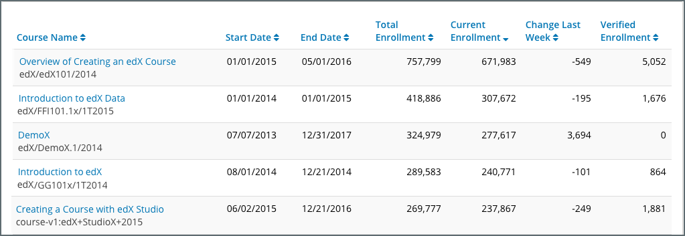

.. _Courses_Page:

#############
Courses Page
#############

Generally, when you access Insights, you start on the edX Insights **Courses**
page. This page provides a dashboard view of all of your courses, including key
information about your courses and top-level enrollment statistics. Which
courses have the most learners enrolled? Which courses have the most learners
working toward a verified certificate? You can quickly answer these questions
using the **Courses** page. 

The courses page provides a table with the following information about each of
your courses.  

* Course Name
* Course ID
* Course Start Date
* Course End Date
* Total Enrollment
* Current Enrollment
* Change Last Week
* Verified Enrollment

To see the Insights view for a specific course, click the course name and ID.
You can then access more data for that course. 

For detailed information about the computations, see :ref:`Enrollment
Computations`.  Note that the enrollment data that the computations include is
the same as the summary metrics presented in the :ref:`Enrollment_Activity`
report.

If you want to view a specific course or courses, enter any part of the course
name or course ID in the **Find a Course** field and click the search icon.

.. note::
 On Edge, the summary table does not include course name, start date, or end
 date. 

*******************************************
Identifying Courses With Highest Enrollment
*******************************************

If you want to find courses with the highest enrollment, you can sort the table
by either the “Total Enrollment” or “Current Enrollment” columns depending on
your metric of interest. This will help you understand which courses attract
the most learners. 

You can sort for “Verified Enrollment” to find courses with the highest number
of verified learners. 

***********************************************
Identifying Recent Changes in Course Enrollment
***********************************************

If you are running course marketing campaigns, you may be interested in looking
at recent changes in enrollment. If you sort by the “Change Last Week” column
in descending order, you can see the courses with the greatest increase in
enrollment in the past week. You will need to draw on your knowledge of recent
marketing efforts to interpret this data, and assess the impact of marketing
efforts on course enrollments. 
