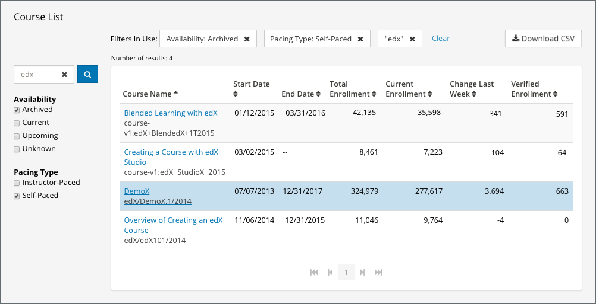

.. _Courses_Page:

#############
Courses Page
#############

Generally, when you access Insights, you start on the edX Insights **Courses**
page. This page provides a dashboard view of all of your courses, including key
information about your courses and top-level enrollment statistics. Which
courses have the most learners enrolled? Which courses have the most learners
working toward a verified certificate? You can quickly answer these questions
using the **Courses** page.

The courses page provides a Course List table with the following information
about each of your courses.

* Course Name
* Course ID
* Course Start Date
* Course End Date
* Total Enrollment
* Current Enrollment
* Change Last Week
* Verified Enrollment

.. note::
 On Edge, the summary table does not include the course name, start date, or
 end date.

.. _Course_List:

*******************************************
Gaining Insight into Course Data
*******************************************

For a quick view of information that's important to you, you can sort the
Course List table by any column. To sort by a specific column, click the title
of that column.

To see the Insights view for a specific course, click the course name and ID.
You can then access more data for that course.

************************
Finding Specific Courses
************************

If you want to find a specific course or courses, use the options in the left
pane. You can search by course name, course ID, availability, and pacing type.

* In the **Find a Course** field, enter any part of the course name or course
  ID, and then click the search icon.
* Under **Availability** or **Pacing Type**, select the options that you want
  to include in your search. The list of courses updates automatically when you
  select or clear an option.

*******************************************
Identifying Courses With Highest Enrollment
*******************************************

If you want to find courses with the highest enrollment, you can sort the table
by either the “Total Enrollment” or “Current Enrollment” columns depending on
your metric of interest. This will help you understand which courses attract
the most learners.

You can sort for “Verified Enrollment” to find courses with the highest number
of verified learners.

***********************************************
Identifying Recent Changes in Course Enrollment
***********************************************

If you are running course marketing campaigns, you may be interested in looking
at recent changes in enrollment. If you sort by the “Change Last Week” column
in descending order, you can see the courses with the greatest increase in
enrollment in the past week. You will need to draw on your knowledge of recent
marketing efforts to interpret this data, and assess the impact of marketing
efforts on course enrollments.

*************************
The Course Summary Report
*************************

Statistics for all of your courses are available for review or download. In
addition to the information that is available on the **Courses** page, the
Course Summary report includes columns for course availability and pacing type,
as well as three different enrollment counts for every enrollment mode.

To download the Course Summary report in a comma-separated value file, select
**Download CSV**. The CSV file contains the following columns.

* availability (shows whether the course is archived, current, or upcoming)
* catalog_course (shows -?)
* catalog_course_title
* count
* count_change_7_days
* course_id
* created
* cumulative_count
* end_date
* enrollment_modes.audit.count
* enrollment_modes.audit.count_change_7_days
* enrollment_modes.audit.cumulative_count
* enrollment_modes.credit.count
* enrollment_modes.credit.count_change_7_days
* enrollment_modes.credit.cumulative_count
* enrollment_modes.honor.count
* enrollment_modes.honor.count_change_7_days
* enrollment_modes.honor.cumulative_count
* enrollment_modes.professional.count
* enrollment_modes.professional.count_change_7_days
* enrollment_modes.professional.cumulative_count
* enrollment_modes.verified.count
* enrollment_modes.verified.count_change_7_days
* enrollment_modes.verified.cumulative_count
* pacing_type
* start_date

For detailed information about the computations, see :ref:`Enrollment
Computations`. Note that the enrollment data that the computations include is
the same as the summary metrics presented in the :ref:`Enrollment_Activity`
report.
