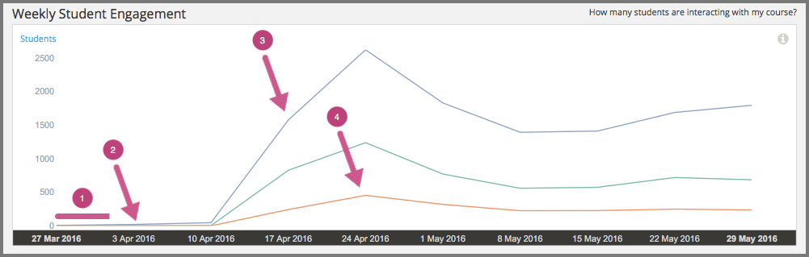
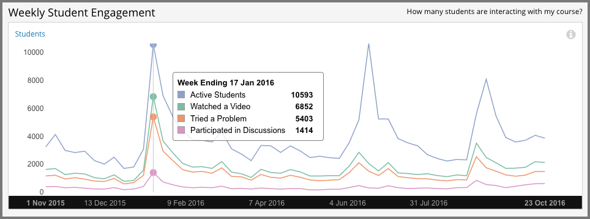

.. _Engagement_Content:

#################################
Engagement with Course Content
#################################

How many of the enrolled learners are actually keeping up with the work? What
are they doing? Content engagement data helps you monitor how many learners are
active in your course and what they are doing.

.. contents::
   :local:
   :depth: 2

Content engagement data is updated every week for the period Monday at 00:00
UTC through Sunday at 23:59 UTC.

********************************************
Gaining Insight into Learner Engagement
********************************************

EdX Insights delivers data about learner engagement in a chart, a set of
metrics, and a report that you can view or download. Descriptions follow; for
detailed information about the computations, see :ref:`Reference`.

======================================
Weekly Learner Engagement Chart
======================================

The markers on this chart represent the number of unique learners who
interacted with course content. The graph plots the following categories of
engagement.

* The count of learners who completed any type of course activity.
* The count of learners who played any course video.
* The count of learners who submitted an answer for a problem.
* The count of learners who added a post, response, or comment to the
  course discussion.

Each total is for activity completed within a one week period. To see the total
count for each activity type for a given week, move your cursor over the chart
to display a tooltip.

Activity is included beginning with the week in which the first page visit took
place. The first page visit is typically by a member of the course team
shortly after course creation.  This data is also available for review in
tabular format and can be downloaded. See the **Content Engagement Breakdown**
report.

Examples of the Weekly Learner Engagement chart follow. The first example shows
a course a few weeks after the start date. The numbered callouts in the image
provide context for the data that is shown.

#. Course development on edx.org, a period when engagement levels were low in
   all three categories.

#. Beta testing, when a slight increase in all of the engagement categories can
   be detected, and ongoing course development.

#. The course start date, when the number of active learners increased
   significantly.

#. The due date of the first homework, when the number of learners who tried a
   problem increased.

The second example is for the edX Demo course. This self-paced course runs
continuously. The tooltip shows the number of learners engaging in different
activities in a high volume week.

======================================
Active Learners Last Week Metric
======================================

The number and percentage of learners who, at least once, visited a page in the
course during the last complete one week period.

======================================
Watched a Video Last Week Metric
======================================

The number and percentage of learners who played at least one of the
course videos during the last complete one week period.

======================================
Tried a Problem Last Week Metric
======================================

The number and percentage of learners who submitted an answer for at least one
problem during the last complete one week period. Not all problem types are
included in this count; see :ref:`Engagement Computations`.

======================================
Participated in Discussions Last Week
======================================

The number and percentage of learners who added a post, response, or comment to
the course discussion during the last complete one week period.

======================================
Content Engagement Breakdown Report
======================================

The weekly breakdown of learner engagement with course content is available for
review or download. Columns show each **Week Ending** date and the count and
percentage of active learners, learners who watched a video, and learners who
tried a problem.

You can download the Content Engagement Breakdown report in comma-separated
value format: select **Download CSV**. The CSV file contains the following
columns.

* any (active learners)
* attempted_problem
* course_id
* created (shows the date and time of the computation)
* interval_end (shows the ending date of the one-week period)
* interval_start (shows the beginning date of the one-week period)
* played_video
* posted_forum

See the :ref:`Reference` chapter for a detailed description of each value.

.. info on why you might want to download, what to do with csv after

***************************************************************
Analytics in Action: Interpreting Data About Learner Engagement
***************************************************************

Many online courses experience periodic drops in learner activity that can be
closely correlated to specific events: problem due dates. Teams can forecast
these changes in engagement, implement strategies to mitigate them, and use
weekly activity counts to monitor their reach.

.. Instead of comparing weekly learner engagement counts to the total course enrollment, many teams define a new baseline for assessing learner engagement after the first assignment is due.

.. not sure where to put this ^

==================================================
An Immediate Appeal, then Ongoing Encouragement
==================================================

To set expectations and encourage a minimum time commitment, one professor
included a one-minute video message as the very first course component.
Speaking directly to the camera, the professor acknowledged that the material
could be daunting. He then made a very specific request: that learners complete
not only the first homework assignment, but the entire first month of the
course, before they made a decision to stop. The professor followed this
initial video with a weekly message to the learners.

The completion and certification rates for the course were higher than average
for the subject. In the course exit survey, learners indicated that the video
messages had a significant motivating effect.

==========================================
Motivation through Public Recognition
==========================================

Some professors encourage learners to stay involved by publicly recognizing the
contributions that they make to the learning environment.

* In one course, the professor wrote weekly updates. Each week she recognized
  learners, by username, for their insightful comments in the course
  discussions.

* Another professor gave special attention to learner questions. He updated the
  course  **Home** page regularly with questions taken from the discussions. He
  followed each question by thanking the learner and giving a direct and
  in-depth answer.

If you post ongoing, regular updates to spotlight learner work, you might
consider adding another element to stimulate involvement. You can include the
count for who tried problems last week, and challenge your learners to increase
participation in the coming week.

.. use of discussions can be added...

==================================================
Gauging the Effectiveness of an Investment
==================================================

Some teams develop a learner engagement strategy for their courses that is
similar to a marketing campaign. They plan the timing and content of messages
to learners and use a variety of delivery channels. If social media channels
are used, messaging typically is delivered daily or even more frequently. Bulk
email messages are usually sent less frequently, and may have longer content.
By comparing the levels of learner engagement week over week, or from run to
run, you can make comparisons to evaluate your strategy.

