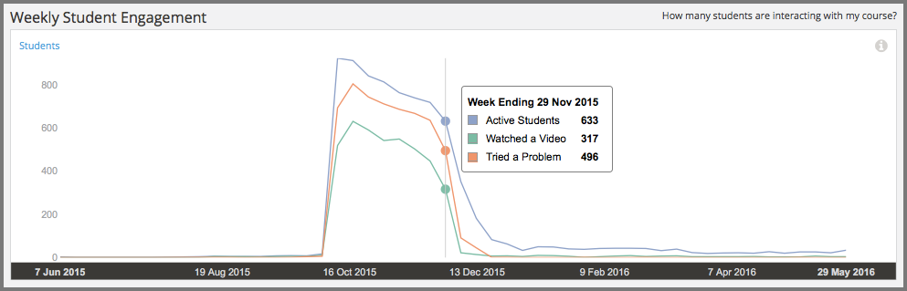

.. _Engagement_Content:

#################################
Engagement with Course Content
#################################

How many of the enrolled students are actually keeping up with the work? What
are they doing? Content engagement data helps you monitor how many students are
active in your course and what they are doing.

.. contents::
   :local:
   :depth: 2

Content engagement data is updated every week for the period Monday at 00:00
UTC through Sunday at 23:59 UTC.

********************************************
Gaining Insight into Student Engagement
********************************************

EdX Insights delivers data about student engagement in a chart, a set of
metrics, and a report that you can view or download. Descriptions follow; for
detailed information about the computations, see :ref:`Reference`.

======================================
Weekly Student Engagement Chart
======================================

The markers on this chart represent the number of unique students who
interacted with course content. The graph plots three categories of engagement:
an overall total for students who completed any type of course activity, and
totals for students who clicked play for any course video and for students who
submitted an answer for a problem. Each total is for activity completed within
a one week period. To see the total count for each activity type for a given
week, move your cursor over the chart to display a tooltip.

Activity is included beginning with the week in which the first page visit took
place. The first page visit is typically by a member of the course team
shortly after course creation.  This data is also available for review in
tabular format and can be downloaded. See the **Content Engagement Breakdown**
report.

Examples of the Weekly Student Engagement chart follow. The first example shows
a course that started only a few weeks ago. Callouts provide context for the
data that is shown by indicating several recent occurences: the beginning of
the beta test, the course start date, and the due date of the first homework.

.. image:: ../images/engagement_chart_start.png
 :alt: A graph showing changes in number of engaged students over time.

In the second example, a small, private online course was developed on one
instance of the platform, and then exported and imported to a different
instance just before the course start date. The tooltip shows the number of
students enaging in different activities on the same day that the final
homework was due.

======================================
Active Students Last Week Metric
======================================

The total number of students who, at least once, visited a page in the course
during the last complete one week period.

======================================
Watched a Video Last Week Metric
======================================

The total number of students who played at least one of the course videos
during the last complete one week period.

======================================
Tried a Problem Last Week Metric
======================================

The total number of students who submitted an answer for at least one problem
during the last complete one week period. Not all problem types are included in
this count; see :ref:`Engagement Computations`.

======================================
Content Engagement Breakdown Report
======================================

The weekly breakdown of student engagement with course content is available for
review or download. Columns show each **Week Ending** date and counts of active
students, students who watched a video, and students who tried a problem.

You can download the Content Engagement Breakdown report in comma-separated
value format: click **Download CSV**. The CSV file contains the following
columns:

* any (active students)
* attempted_problem
* course_id
* created (shows the date and time of the computation)
* interval_end (shows the ending date of the one-week period)
* interval_start (shows the beginning date of the one-week period)
* played_video

See the :ref:`Reference` chapter for a detailed description of each value.

.. info on why you might want to download, what to do with csv after

***************************************************************
Analytics in Action: Interpreting Data About Student Engagement
***************************************************************

Many online courses experience periodic drops in student activity that can be
closely correlated to specific events: problem due dates. Teams can forecast
these changes in engagement, implement strategies to mitigate them, and use
weekly activity counts to monitor their reach.

.. Instead of comparing weekly student engagement counts to the total course enrollment, many teams define a new baseline for assessing student engagement after the first assignment is due.

.. not sure where to put this ^

==================================================
An Immediate Appeal, then Ongoing Encouragement
==================================================

To set expectations and encourage a minimum time commitment, one professor
included a one-minute video message in the very first course component.
Speaking directly to the camera, the professor acknowledged that the material
could be daunting. He then made a very specific request: that students complete
not only the first homework assignment, but the entire first month of the
course, before they made a decision to stop. The professor followed this
initial video with a weekly message to the students.

The completion and certification rates for the course were higher than average
for the subject. In the course exit survey, students indicated that the video
messages had a significant motivating effect.

==========================================
Motivation through Public Recognition
==========================================

Some professors encourage learners to stay involved by publicly recognizing the
contributions that they make to the learning environment.

* In one course, the professor wrote weekly updates. Each week she recognized
  students, by username, for their insightful comments in the course
  discussions.

* Another professor gave special attention to student questions. He updated the
  **Course Info** page regularly with questions taken from the discussions. He
  followed each question by thanking the student and giving a direct and
  in-depth answer.

If you post ongoing, regular updates to spotlight student work, you might
consider adding another element to stimulate involvement. You can include the
count for who tried problems last week, and challenge your students to increase
participation in the coming week.

.. use of dicussions can be added...

==================================================
Gauging the Effectiveness of an Investment
==================================================

Some teams develop a student engagement strategy for their courses that is
similar to a marketing campaign. They plan the timing and content of messages
to students and use a variety of delivery channels. If social media channels
are used, messaging typically is delivered daily or even more frequently. Bulk
email messages are usually sent less frequently, and may have longer content.
By comparing the levels of student engagement week over week, or from run to
run, you can make comparisons to evaluate your strategy.

.. Patrick ok'd 9/24/14
