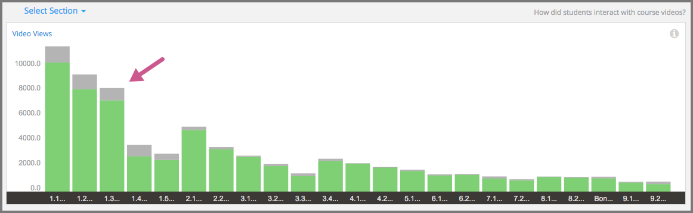
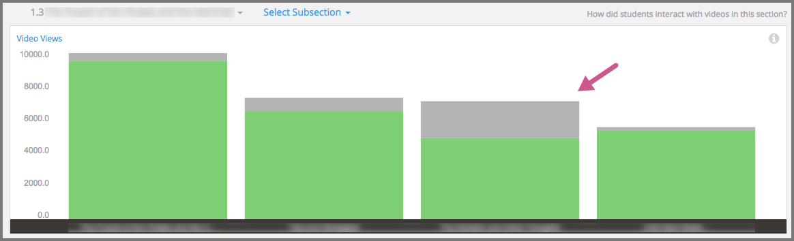
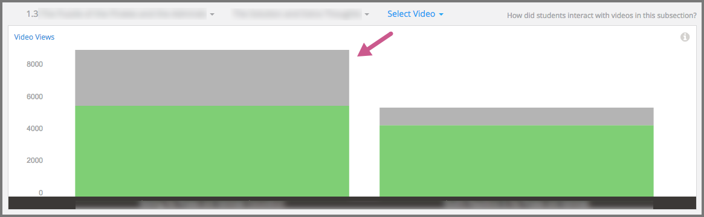
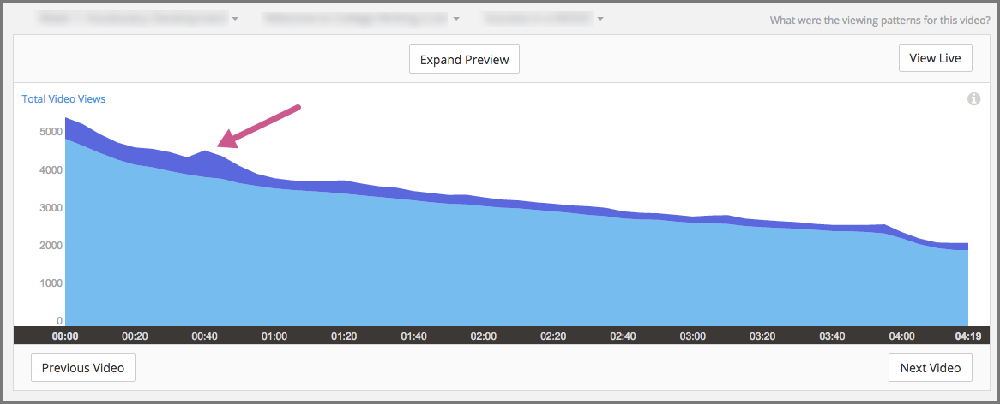
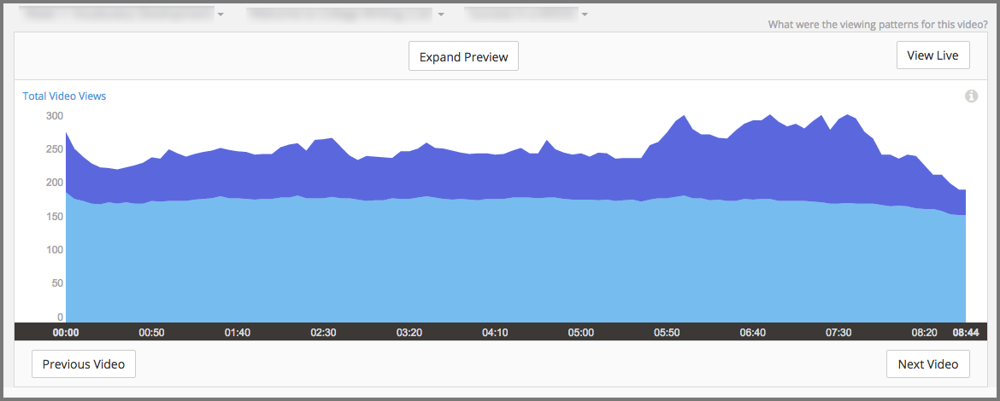
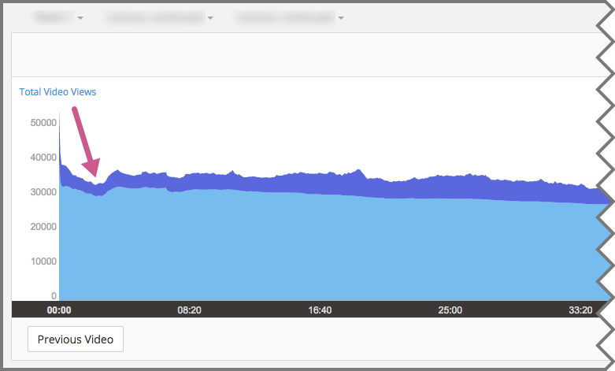
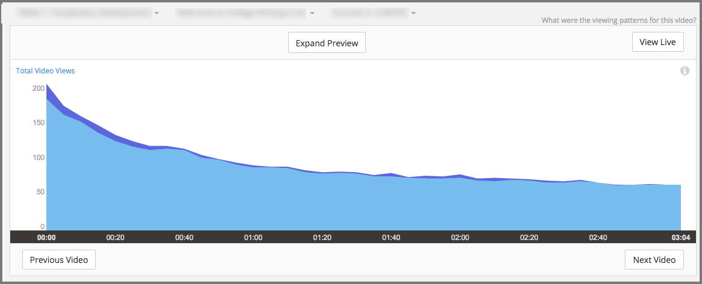
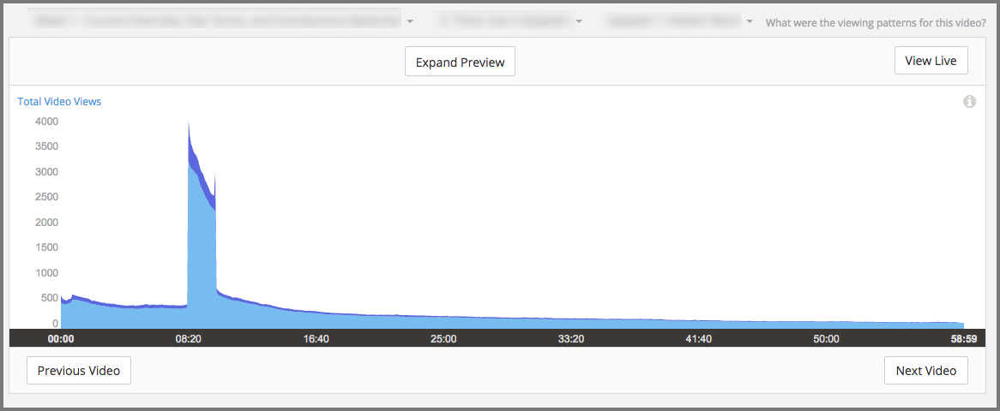
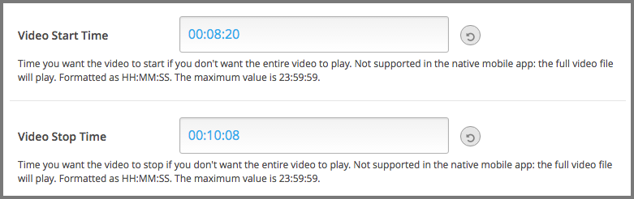

.. _Engagement_Video:

#############################
Engagement with Course Videos
#############################

Are learners watching the course videos? Do they watch some videos more than
others? Of those who watched a video, what percentage watched it to the end? Do
learners watch certain parts of the video more than once? The video engagement
data in edX Insights gives you information to gain perspective on your
learners' viewing patterns.

.. contents::
   :local:
   :depth: 2

Video engagement data is updated every day to include video activity through
the end of the previous day (23:59 UTC).

********************************************
Gaining Insight into Viewing Patterns
********************************************

EdX Insights delivers data about learner engagement with videos in a series of
charts and reports. Charts, metrics, and data are available for each of the
videos in your course. To access data about a specific video, you select the
section and subsection that contain that video. As you make these selections,
edX Insights provides data about viewing patterns for all of the videos in that
part of the course outline.

For detailed information about the computations, see :ref:`Reference`.

*********************************************
Selecting the Section, Subsection, and Video
*********************************************

To access data about a video component, follow these steps.

#. Open edX Insights at `insights.edx.org`_. A list of your courses appears.

#. Select the course.

#. Select **How did learners interact with course videos?** Alternatively,
   select **Engagement** and then **Video**. A stacked bar chart shows the
   number of complete and incomplete views, averaged by the number of videos in
   each section.

#. Select a section. A stacked bar chart shows complete and incomplete views,
   averaged by subsection.

#. Select a subsection. A stacked bar chart provides the number of complete and
   incomplete views for each of the videos in the subsection.

#. Select the video component you want to review in detail. A chart, metrics,
   and a table of viewing data for the video file appears.

For detailed information about the computations, see :ref:`Reference`.

*******************************************************
Analytics in Action: Interpreting Viewing Patterns
*******************************************************

A review of what learners in your course watch can lead to discoveries
about your videos and about your course.

* You can determine how many learners watch each video.

* You can determine how many learners watch the entire video, and where the
  other learners drop out.

* You can find video segments that learners watched more than once.

* You can discover what learners decide not to watch.

You can use this information to guide research on your video files and assess
where you might make changes.

=======================================================
Investigating Video Views for Sections and Subsections
=======================================================

To access data about a video, you select the section and subsection that
contain the video. When you make each of these selections, edX Insights
provides data about complete and incomplete video views.

In this chart of video views for the sections in a completed course, each bar
represents the number of views of all videos in a section. Each of the bars is
divided into the number of completed views in green and the number of
incomplete views in gray.

  video watching in each course section, with the third section indicated as
  having a comparatively high incomplete percentage.

Reviewing the data in this chart might lead you to investigate several
questions. You might want to understand why there are so many more incomplete
views in some of the sections than in others. If your course has short videos
in some sections, and comparatively longer videos in other sections, does that
make a difference in the completion rates? Are there differences in quality?
Could you have, accidentally or deliberately, included the same video file in
your course more than once?

When you select a section with a relatively low average of complete views,
another stacked bar chart appears for the subsections in that section.

     thirds of the learners who started videos finished watching them.

This chart helps you focus your investigation on the third subsection, in which
the completion percentage dropped to 68%. After you select that subsection, the
chart for the actual counts of complete and incomplete views for the videos in
the unit appears.

  views and another with a much higher percentage of complete views.

Once again, the data can help guide your investigation into possible causes for
the disproportionate number of incomplete video views.

================================
Researching Replayed Segments
================================

When you review the chart for a video, you can see which five second segments
learners played more than once. The stacked area graph shows replays in darker
blue above plays by unique users.

When you see the graph for this video, you decide to investigate what exactly
happens at the 40 second mark.

  seconds into the video.

To find out what that segment of the video contains, you select **Expand
Preview** to open the video player for that video. In this video, you realize
that a single word, right at 00:40, is difficult to understand. However,
because the transcript for the video is accurate, you might decide that no
further action is needed in this case.

You might then select **Next** to review the data for the next video component
in the courseware. In that video, the stacked area graph shows that learners
replayed certain segments of the video, particularly near the end, more often
than others.

     the last three minutes of the video.

After you preview that video, you might decide that the increased number of
replays was an indicator of the complexity of the material being covered. You
might decide to spend some extra time answering questions in the discussion
topic for that unit, or provide a course handout with additional references on
the material covered for learners who want them.

==========================================
Establishing an Engagement Baseline
==========================================

Week 1 of your course begins with a videotaped lecture that is about an hour
long. About two weeks after the course start date you use the video metrics
available in edX Insights to find that over 35,000 learners started playing
the video, and that almost 18,000 learners completed it.

You decide that this count of 18,000 will be a more meaningful baseline of
committed learners than the overall course enrollment count. As your course
progresses, you use the number of learners who completed the first video as
the basis for evaluating how many learners continue to engage with course
content.

===================================
What Are They Not Watching?
===================================

In addition to giving you information about how many learners are watching your
course videos, edX Insights can also help you investigate what, and when, they
choose not to watch.

When you see the graph in edX Insights for this video, you notice that there is
a temporary drop in the number of completed segment views near the beginning of
the video. This goes on for about a minute, and then the number recovers to the
previous level.

     of the video, but then resumed playing in the fourth minute.

This pattern indicates that learners chose to skip whatever was included in
that part of the video, but then they began playing the video again about a
minute further on.

In another video, the stacked area graph shows a steady decline in views and
very little replay activity.

     the first 30 seconds of a video, and only 35% were watching by the end.

This pattern indicates that learners who began to play the video did not
continue to the end, and that they rarely chose to replay any of its segments.

The course teams might be curious to learn why learners chose to skip over part
of a video or to stop watching it completely. Analyzing the content of a video
with the objectivity that you gain from edX Insights can help you find content
that is not well matched to its audience. Perhaps you included an interview
that is pertinent for a residential learner, but that your MOOC participants
find less interesting than other material. Or perhaps the video included
repetition that most of your learners did not need to grasp a concept.

Course teams that try to deduce the cause of viewing patterns like these might
not take any action for a currently running course. However, they might share
their deductions in an organizational "video best practices guide" for future
reference.

===============================================
Understanding the Results of Component Design
===============================================

Insights can also help you understand how the choices that you make when you
add video components to your course can affect your learners. The chart for
this video shows an unusual viewing pattern, with most learners watching for
only a minute or so, beginning at 8:20.

     beginning, then over 3000 began watching at 8:20, with a sharp drop off
     after 10:05. Only 23% completed the entire video.

To understand this viewing pattern, you might follow these steps.

#. Select **View Live**, and then in the LMS select **View Unit in Studio**.

#. For this video component, select **Edit**, and then **Advanced Settings**.

When you review the video component settings, you realize that start and stop
times were defined to artificially reduce the length of the video from almost
an hour to less than two minutes.

     set to 8:20 and the Video Stop Time is set to 10:08.

The edX video player applies the start and stop times defined in Studio only
when learners watch videos in a browser. As a result, you might conclude that
viewers who watched the video before and after the defined start and stop times
are using the edX mobile applications. You might then decide to make the entire
video available to all of your learners by removing the start and stop times.
Alternatively, you might edit the file and then upload a new version that
includes only the relevant section of the video.

.. _insights.edx.org: https://insights.edx.org
