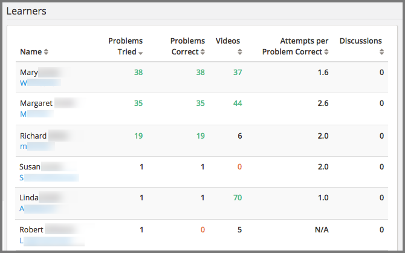
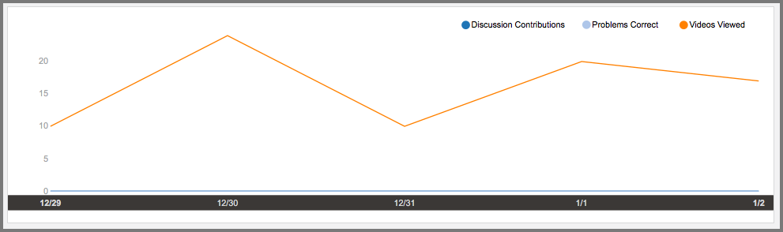
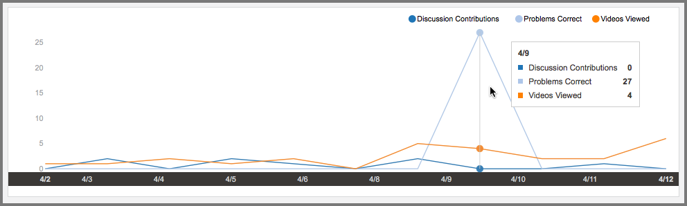
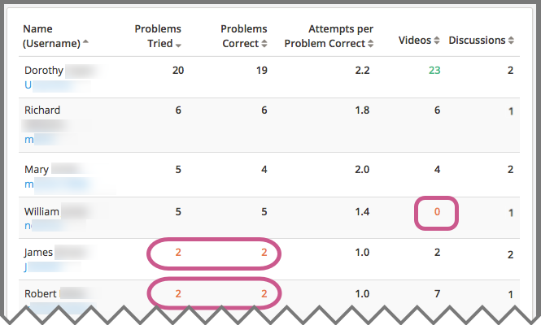

.. _Learners:

################
Learner Activity
################

.. note:: This feature is not yet supported. EdX is currently testing the
 per learner activity feature.

Which learners, specifically, are engaging with my course? Who is struggling,
and who is doing well? Investigating and comparing the activities of individual
learners helps you focus on those who are most likely to benefit from
additional attention.

.. contents::
   :local:
   :depth: 2

Learner data is updated every day to include activity through the end of the
previous day (23:59 UTC).

**************************************************
Gaining Insight into Individual Learner Activities
**************************************************

EdX Insights delivers data about the activities of individual learners in a
report and in charts of activity over time. Descriptions follow; for detailed
information about the computations, see
:ref:`Learner Computations`.

=========================================
Learner Roster and Key Activity Report
=========================================

EdX Insights delivers data about the engagement of individual learners by
providing counts for the following key activities.

* Problems Tried
* Problems Correct
* Attempts per Problem Correct
* Videos played
* Discussion contributions added

The report includes one row for every learner who ever enrolled in the
course. The reported metrics represent each learner's activity in the course
during the last seven days, through end of day (UTC) yesterday.

Reviewing the Report
********************

To review the learner roster and key activity report, you select **Learners**
at the top of any Insights page. By default, the report shows data for all
learners.

To find data that is of interest to you, the report includes the
following options.

* Sort by username or by an activity metric, in ascending or descending order.

* Search for a learner by name or username.

* Select one cohort (in a course that includes learner cohorts).

To help you compare an individual learner's level of engagement to that of the
class as a whole, the numbers on the report are color coded.

* Red: The learner's activity is in the 15th percentile or below. These
  learners might be falling behind or struggling.

* Green: The learner's activity is in the 85th percentile or above. These
  learners might be doing particularly well.

* Black: All other values.

An example roster follows. In this example, the report is sorted in descending
order by number of problems tried.

  different percentiles.

.. Downloading the Report

========================
Learner Activity Chart
========================

To review the learner activity chart, you select the learner's username in the
learner roster and key activity report.

The learner activity chart is a timeline that shows when a selected learner was
active in the course. The markers on this chart represent the number of times
the learner interacted with the course each day. The graph plots the following
types of activity.

* Discussion Contributions
* Problems Correct
* Videos Viewed

The chart shows when a learner was active in the course, beginning with the
first day that one of these activities took place, and ending with the last day
that one these activities took place. The timeline is not limited to activity
in the last seven days.

Examples of learner activity charts follow. The first example shows the
activity chart for a learner who is playing 10 or more course videos every
day. However, the learner is not answering any problems correctly, and has not
yet contributed to the discussions.

     correct activity, but ongoing video activity.

This learner might be getting exactly what they want out of the course, the
opportunity to learn from the videos. However, you might want to go back to the
learner roster and key activity report to see if this learner is attempting to
answer problems, but not managing to answer any correctly.

The next example shows the activity chart for a learner who watches one or more
videos almost every day, and who has occasionally contributed to the
discussions. However, there was only a single day on which this learner
answered any problems correctly. The tooltip shows the counts for each type of
activity on that day.

     and a single day with problems correct activity.

Knowing the context of how your course is set up, this pattern might indicate
when the learner reached the first homework assignment. Or, it might indicate
that the learner completed all of the ungraded practice questions and the
midterm on one day.

**************************************************************
Analytics in Action: Interpreting Individual Activity Patterns
**************************************************************

A review of how many times each of the learners in your course completed key
activities, and when, can help you identify learners who are most likely to
need some form of intervention.

====================================
Identifying Learners Who Are At Risk
====================================

To identify learners who are falling behind, and who might be at risk of
failing, course teams can use the 15th percentile and below color coding that
is automatically indicated for values on the learner roster and key activity
report. For example, a course team member can sort the report using any of the
metrics, and then scan the report to locate any learners with a value that
appears in red. In the example that follows, reported values in the 15th
percentile and below appear in red and are circled.

     any videos at all, and two other learners who have only tried two
     problems.

When you review the report, your knowledge of the context can help you decide
whether, and how, to intervene. Some possible scenarios follow.

* The course is a small private online course and it began three days ago. The
  report shows that many learners are engaging with the course, though some
  more than others. You decide to send an email message to all enrolled
  learners at the end of the first week to congratulate them on their efforts
  so far, and to point out that they can track their own achievements on the
  **Progress** page.

* The course is an on campus course, and the third week just started. You use
  the report to identify the learners who are not on pace to complete the
  course successfully, but who might be able to catch up. You make sure that
  all of your teaching assistants know how to use the report to identify such
  learners in their sections.

You can use the learner activity report throughout the course run to guide your
decisions about when, and how, to contact learners who are struggling.

==============================
Promoting Learner Interaction
==============================

A course has several small cohorts with a teaching assistant (TA) assigned to
each one. The members of these cohorts are expected to contribute to the
discussions at least once a week throughout the course run. In turn, the TAs
are responsible for making sure that any questions that cohort members post in
the course discussions get prompt and thorough answers.

The learner roster and key activity report can make monitoring discussion
activity easier for these TAs. The cohort filter and column sorting features
can help them identify the cohort members who are contributing to the
discussions. They can also search by username to find the activity reported for
individual cohort members. The learner activity charts can show, at a glance,
whether discussion activity is a regular part of a learner's weekly involvement
in the course, or if it takes place more sporadically.

==========================
Recruiting Job Candidates
==========================

An organization used their MOOC as a recruiting tool. They defined a set of
criteria for potential job candidates, including metrics that would reflect
engagement over time, mastery of the material, and interaction with other
learners. Learners who met or exceeded these criteria were automatically placed
into consideration for a screening interview.

==================================
Identifying Questionable Activity
==================================

Certain activity patterns can alert you to behavior that might be either
exemplary or counterproductive.

* A learner has a high problems correct total, and a very low ratio of attempts
  per problem correct: a top performer. When you look at that learner's
  activity chart, however, you see that all of the problems were answered
  correctly on the very first day the course opened. Did this learner enroll in
  the audit track for a previous course run, and is now taking the course for a
  second time in the verified track? Or, could this learner have violated the
  honor code?

* A learner is in the 85th percentile (or above) for discussion contributions:
  a highly engaged community member. However, the same learner has zero
  problems attempted and zero videos played, so the discussions are the only
  type of key course activity in which the learner engages. Is this learner
  answering questions thoughtfully and with accurate information? Or, have any
  of this learner's discussion posts been flagged as inappropriate?

You can use learner data to identify unusual combinations of activity and
decide whether to investigate further.
