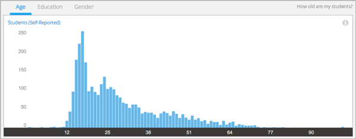
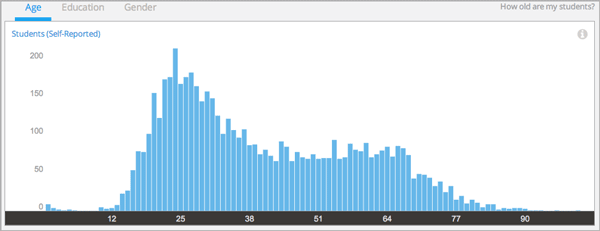

.. _Demographics_Age:

#############################
Age Demographics
#############################

How old are my students? Awareness of the ages reported by your students can
help you understand whether a target audience is enrolled in your course.

Student demographic data is updated every day to include changes in enrollment
through 23:59 UTC the previous day.

********************************************
Gaining Insight into Student Age
********************************************

Students can report a year of birth when they register for an account on
edx.org or edge.edx.org. Student ages, derived from year of birth, are provided
in a chart, a set of metrics, and a report that you can view or download.
Descriptions follow; for detailed information about the computations, see
:ref:`Reference`.

======================================
Self-Reported Student Age Chart
======================================

Each bar on this chart represents the total number of enrolled learners who are
a given age, based on reported year of birth. Moving your cursor over a bar in
the chart shows a tip with the number of students of that age.

The chart includes every reported age. This data is also available for review
in tabular format and can be downloaded.

A couple of examples of this chart follow for different courses. The first
example shows the age distribution for an Advanced Placement (AP) course.

         and 18

.. RiceX/AdvBIOx/2014T3/enrollment/demographics/age/

AP courses typically are designed to be taken by students of high school age.
The chart confirms that most students are teenagers and young adults, but
reveals that the enrollment also includes students who reported other ages.

The second example shows the Self-Reported Student Age chart for a MOOC.

         fairly comparable numbers of students for ages 38 through68 

.. ColumbiaX/HIST1.1x/3T2014/enrollment/demographics/age/

This chart shows a more evenly distributed range of adult ages. 

In both charts, note that students report ages of 0 and 100+. To gain a more
accurate understanding of the ages of the students in any course, its course
team might add a survey.

See the :ref:`Reference` chapter for a detailed description of how edX computes
student age values.

======================================
Median Age Statistic
======================================
  
This statistic indicates that half of the students in your course who reported
their ages are younger, and half older, than the value that is shown.

======================================
Age Band Metrics
======================================
  
Three age ranges, or bands, are provided to give you a different at-a-glance
perspective of the distribution of student ages. The percentage of students  in
each band is shown.

======================================
Age Breakdown Report 
======================================

The number of students reporting each age, as of the date of the last update,
is available for review or download. The report includes a row for each age,
with columns for **Number of Students** and **Percentage**. The report also
includes a row for enrolled students who did not supply this data.

To download the Age Breakdown report in a comma-separated value file,
click **Download CSV**. The CSV file contains the following columns: 

* birth_year
* count
* course_id
* created (the date and time of the computation)
* date

.. info on why you might want to download, what to do with csv after

*******************************************************
Analytics in Action: Interpreting the Age Distribution
*******************************************************

===========================
Learning for the Fun of It
===========================

For the professor of a computer science MOOC, students in the 41+ age band were
a target audience from the inception of the course. This professor used the 41+
age band to represent people who take online courses for the pleasure of
learning something new, rather than to pass exams or gain credentials. The
professor designed the course to be self-paced, a structure that he believed
made more sense for those students than a schedule of regular deadlines.

To find out whether the course had successfully attracted the expected
audience, the professor checked the age distribution of the students who
enrolled in the course.

In edX Insights, the chart, age band metrics, and breakdown report provide
different ways to learn about the students who are enrolled in a course.
