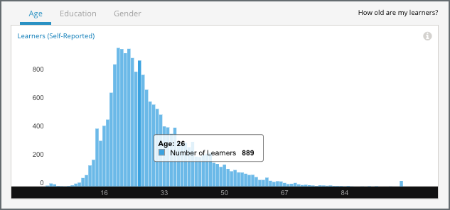

.. _Demographics_Age:

#############################
Age Demographics
#############################

How old are my learners? Awareness of the ages reported by your learners can
help you understand whether a target audience is enrolled in your course.

.. contents::
   :local:
   :depth: 2

Learner demographic data is updated every day to include changes in enrollment
through 23:59 UTC the previous day.

********************************************
Gaining Insight into Learner Age
********************************************

Learners can report a year of birth when they register for an account on
edx.org or edge.edx.org. Learner ages, derived from year of birth, are provided
in a chart, a set of metrics, and a report that you can view or download.
Descriptions follow; for detailed information about the computations, see
:ref:`Reference`.

======================================
Self-Reported Learner Age Chart
======================================

Each bar on this chart represents the count of currently enrolled learners who
are a given age, based on reported year of birth. Moving your cursor over a bar
in the chart shows a tooltip with the number of learners of that age.

The chart includes every reported age. This data is also available for review
in tabular format and can be downloaded.

An example of this chart follows. The example shows the Self-Reported Learner Age chart for a MOOC.

       for 19 through 28.
   :width: 600

Note that some learners report ages of 0 and 100+. To gain a more accurate
understanding of the ages of the learners in any course, the course team might
add a survey.

See the :ref:`Reference` chapter for a detailed description of how edX computes
learner age values.

======================================
Median Age Statistic
======================================

This statistic indicates that half of the learners in your course who reported
their ages are younger, and half older, than the value that is shown.

======================================
Age Band Metrics
======================================

Three age ranges, or bands, are provided to give you a different at-a-glance
perspective of the distribution of learner ages. The percentage of learners in
each band is shown.

======================================
Age Breakdown Report
======================================

The number of learners reporting each age, as of the date of the last update,
is available for review or download. The report includes a row for each age,
with columns for **Number of Learners** and **Percentage**. The report also
includes a row for enrolled learners who did not supply this data.

To download the Age Breakdown report in a comma-separated value file,
click **Download CSV**. The CSV file contains the following columns:

* birth_year
* count
* course_id
* created (the date and time of the computation)
* date

.. info on why you might want to download, what to do with csv after

*******************************************************
Analytics in Action: Interpreting the Age Distribution
*******************************************************

===========================
Learning for the Fun of It
===========================

For the professor of a computer science MOOC, learners in the 41+ age band were
a target audience from the inception of the course. This professor used the 41+
age band to represent people who take online courses for the pleasure of
learning something new, rather than to pass exams or gain credentials. The
professor designed the course to be self-paced, a structure that he believed
made more sense for those learners than a schedule of regular deadlines.

To find out whether the course had successfully attracted the expected
audience, the professor checked the age distribution of the learners who
enrolled in the course.

In edX Insights, the chart, age band metrics, and breakdown report provide
different ways to learn about the learners who are enrolled in a course.
