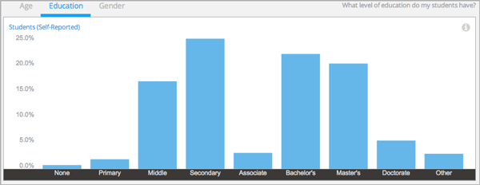

.. _Demographics_Education:

###################################
Education Demographics
###################################

What educational background do my learners have? Evaluating the stages of
formal education that your learners have completed can help you understand
whether your course is enrolling people with the learning background that you
expect.

.. contents::
   :local:
   :depth: 2

Learner demographic data is updated every day to include changes in enrollment
through 23:59 UTC the previous day.

********************************************
Gaining Insight into Learner Education
********************************************

Learners can select a "highest level of education completed" when they register
for an account on edx.org or edge.edx.org. Education data for the learners
enrolled in your course is provided in a chart, a set of metrics, and a report
that you can view or download. Descriptions follow; for detailed information
about computations, see :ref:`Reference`.

======================================
Self-Reported Learner Education Chart
======================================

The bars on this chart represent the percentage of enrolled learners who
reported completion of a level of education. Moving your cursor over
the chart shows the percentage for each level, calculated to one decimal place.

Learner education data is also available for review in tabular format and can
be downloaded.

An example of this chart follows.

       school, and college graduates in the course.
   :width: 600

Depending on the goals of the course team, distributions can be interpreted as
indicators of the success of enrollment efforts, or indicate that changes may
be needed to reach the target demographic.

* One team wants to involve learners with a wide range of educational
  backgrounds. The distribution in the chart can be interpreted as
  confirmation of enrollment by a diverse population.

* Another team has designed an advanced course. The distribution in the
  chart alerts the team that people who might need additional resources to
  succeed are enrolling. The team could review how course prerequisites are
  stated, or whether marketing efforts are reaching the correct audience.

See the :ref:`Reference` chapter for a detailed description of the educational
background categories.

======================================
Education Band Metrics
======================================

Three groups, or bands, are provided to give you another perspective on the
distribution of educational levels among your learners. The percentage of
learners in each band is shown.

======================================
Education Breakdown Report
======================================

The number of learners reporting completion of each educational level, through
the date of the last update, is available for review or download. The report
includes a row for each educational level and a column for the **Number of
Learners**. The report also includes a row labeled **Unknown** for enrolled
learners who did not supply educational data.

To download the Education Breakdown report in a comma-separated value file,
click **Download CSV**. The CSV file contains the following columns:

* count
* course_id
* created (the date and time of the computation)
* date
* education_level

.. info on why you might want to download, what to do with csv after

.. secret column in CSV for number who did not provide?

***********************************************************************
Analytics in Action: Interpreting Distribution of Educational Levels
***********************************************************************

===================
Not Enough Calculus
===================

As one professor of computer science prepared to launch a new MOOC, he checked
the responses that learners were giving for level of education completed. On
campus, the course was targeted to first-year college learners, and the About
page of the MOOC described it as college level. The professor expected that
most learners would be high school graduates at least, and the responses did
show that a majority of the enrollees had completed high school or above. Even
so, a significant percentage of the enrollees had only finished middle or
primary school, and the professor was concerned. How could those learners know
enough calculus?

The professor realized that what he really wanted to know was the level of
learner preparedness in that specific subject, calculus. The information on
learner educational background for this course run, while thought-provoking,
was too general to use as the basis for any last-minute decisions about the
marketing or design of the course. Just in case, the professor did compile a
list of resources for a course update.

For a future course run, this professor could add an assessment early in the
first week to test for the expected knowledge. To find the number of learners
who select each answer for a problem, including both incorrect and correct
answers, you can download the `Learner Answer Distribution`_ report.

.. _Learner Answer Distribution: http://edx.readthedocs.org/projects/edx-partner-course-staff/en/latest/running_course/course_answers.html#student-answer-distribution
