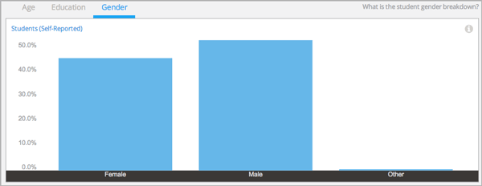
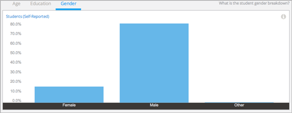

.. _Demographics_Gender:

################################
Gender Demographics
################################

What is the gender balance in my course? Knowing the male-female ratio in your
course can help you understand who is enrolling in your course and whether the
balance changes over time.

Student demographic data is updated every day to include changes in enrollment
through 23:59 UTC the previous day.

********************************************
Gaining Insight into Student Gender
********************************************

Students can identify themselves with a gender by selecting **Female**,
**Male**, or **Other** when they register for an account on edx.org or
edge.edx.org. Student gender data is provided in a chart and a report that you
can view or download. Descriptions follow; for detailed information about the
computations, see
:ref:`Reference`.

======================================
Self-Reported Student Gender Chart
======================================

The bars on this chart represent the most recently calculated percentage of
enrolled learners who reported a gender of **Female**, **Male**, or **Other**.
Moving your cursor over the chart shows the percentage for that gender,
calculated to one decimal place.

Student gender data is also available for review in tabular format and can be
downloaded.

Examples of this chart for two different courses follow. 

.. RiceX/AdvBIOx/2014T3/enrollment/demographics/gender/

.. MITx/8.MReVx/2T2014/enrollment/demographics/gender/

Both of these charts are for science courses, and those courses have the same
median age, 25. Each of these course teams might use information about the
percentages of enrolled men and women as a starting point for an investigation
into how students learn about their course offering and make the decision to
enroll in the course.

See the :ref:`Reference` for a detailed description of how student gender
values are computed.

======================================
Gender Breakdown Over Time Report 
======================================

The daily total enrollment count with gender breakdown is available for review
or download. Columns show each date, the total enrollment on that date, and
breakdown columns for the number of people who reported each gender category
and who did not provide this information at registration.

To download the Gender Breakdown Over Time report in a comma-separated value
file, click **Download CSV**. The CSV file contains the following columns:

* course_id
* created (the date and time of the computation)
* date
* female
* male
* other
* unknown

.. info on why you might want to download, what to do with csv after

*******************************************************
Analytics in Action: Interpreting Gender Distribution
*******************************************************

===============================================
Researching an Unanticipated Disparity
===============================================

Not long before launch, the team for a math MOOC checked the demographics for
the students who had enrolled. They were surprised to observe a gender
imbalance that was far more acute than they had ever seen in their on-campus
version of the class.

The team looked into possible contributing factors, and realized that the
audiences of the journal articles and blog posts that had been written about
the course skewed heavily male. They also reread the course About page to see
if it represented the course differently than they had intended.

Even more important to the team than finding potential causes was to make an
effort to enroll more women in the course. To do so, the team subsequently
partnered with professional women’s organizations for guidance on ways to
market the course to their members. 

Today, teams can use edX Insights to monitor the success of such outreach
efforts by checking the Gender Breakdown Over Time report and CSV file for
enrollment trends.
