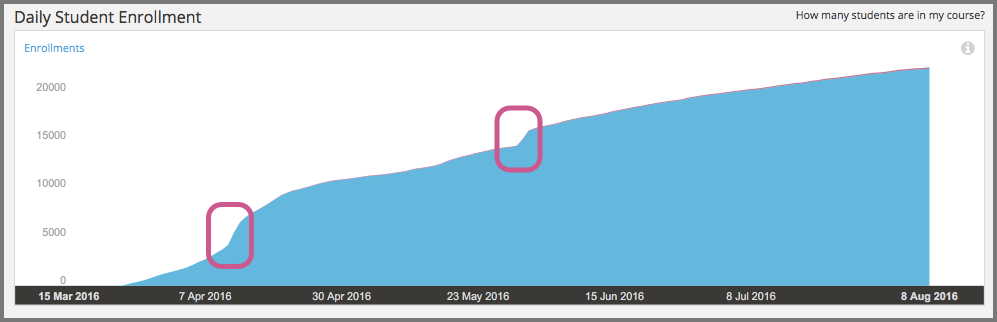
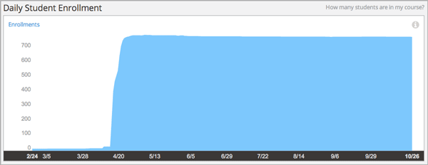

.. _Enrollment_Activity:

#############################
Enrollment Activity
#############################

How many learners are enrolled in my course? Enrollment activity data helps you
monitor how many people are enrolling in your course and how that number
changes over time.

.. contents::
   :local:
   :depth: 2

Enrollment activity data is updated every day to include changes in enrollment
through the end of the previous day (23:59 UTC).

********************************************
Gaining Insight into Course Enrollment
********************************************

EdX Insights delivers enrollment activity data in a chart, a set of metrics,
and a report that you can view or download. Descriptions follow; for detailed
information about the computations, see :ref:`Reference`.

======================================
Daily Learner Enrollment Chart
======================================

The daily learner enrollment chart is a stacked area chart: the filled area
represents the number of learners enrolled in the course on a particular date.
For courses that offer more than one enrollment option or track, different
colors represent the number of learners who were enrolled with each option.

The chart includes each of the enrollment options and tracks that are offered
for your course. Moving your cursor over the chart shows a tooltip with the
counts for each enrollment type, and the current enrollment, for each day.

The chart includes enrollment data for every day, beginning with the first
enrollment (typically of the course creator). This data is also available for
review in tabular format and can be downloaded.

A couple of examples of this chart follow for different courses. In the first
example, for a MOOC, you see enrollment climb fairly steadily over a period of
several months. The markers begin with four enrollments (almost
certainly the course creator and other course team members) on the day the
course was created in Studio.

       and the tooltip showing the number of enrolled students on a specific
       date.
 :width: 600

The chart reveals different time periods when the rate of new enrollments
increased rapidly, or "spiked" (circled). The team for this course might have
the contextual knowledge to correlate those periods with marketing efforts or
automated enrollment events, or might want to research possible explanations.
After the first spike, which coincided with the course start date on 15 April,
enrollment continued to increase and an additional spike occurred over a month
later.

The second example shows the Daily Learner Enrollment chart for a small,
private online course. In this course, the course team used the instructor
dashboard in the LMS to enroll almost all of the learners in just a few
days.

See the :ref:`Reference` for a detailed description of how enrollment values
are determined.

======================================
Total Enrollment Metric
======================================

This count reports the number of learners who have ever enrolled in the
course.

======================================
Current Enrollment Metric
======================================

This count reports the number of learners who have enrolled in the course, less
any learners who have unenrolled.

======================================
Change in Last Week Metric
======================================

This metric reports the difference between the current enrollment count at the
end of the day yesterday and at the end of the day one week ago.

======================================
Verified Enrollment Metric
======================================

This count reports the number of currently enrolled learners who have elected
to pursue a verified certificate for the course.

======================================
Enrollment Over Time Report
======================================

The daily count of current enrollments, through the date of the last update, is
available for review or download. Columns show each **Date** and its **Current
Enrollment**.

The report includes an additional column for each of the certification options
or enrollment tracks that are offered by the course, such as **Verified** and
**Audit** or **Professional** and **Audit**.

To download the Enrollment Over Time report in a comma-separated value file,
select **Download CSV**. The CSV file contains the following columns.

* audit
* count (current enrollment)
* course_id
* created (the date and time of the computation)
* credit
* cumulative_count (total enrollment)
* date
* honor
* professional
* verified

.. info on why you might want to download, what to do with csv after

*******************************************************
Analytics in Action: Interpreting Changes in Enrollment
*******************************************************

===========================
The Colbert "Bump"
===========================

Enrollment for courses on the edX.org site opens several months before the
course start date. This strategy typically results in gradually increasing
enrollments over time, as site visitors find a course, sign up for it, and tell
their colleagues, friends, and family about it. This strategy also gives teams
the opportunity to watch for larger changes in enrollment, the temporary
"spikes" that can occur after particular events, such as marketing campaigns
for the course or for edX in general.

Such events can be expected or unexpected: teams for all edX courses saw a
large jump in the number of enrollments in the summer of 2013, in the days
after edX CEO Anant Agarwal was interviewed on the July 24 edition of *The
Colbert Report*, a satirical late-night comedy show hosted by Stephen Colbert.

===========================
Latecomers Welcome
===========================

After their course started, a team expected that enrollment would level off and
then begin a gradual decline. While they did see an overall decline in the
number of enrollments, they also noticed that occasional small spikes in
enrollment continued to occur, even several weeks into the course. To give
these recently-enrolled learners time to catch up, the team chose to adjust the
course to be more self-paced. They shifted due dates in unreleased units later,
and extended the end date to keep course content open longer.
