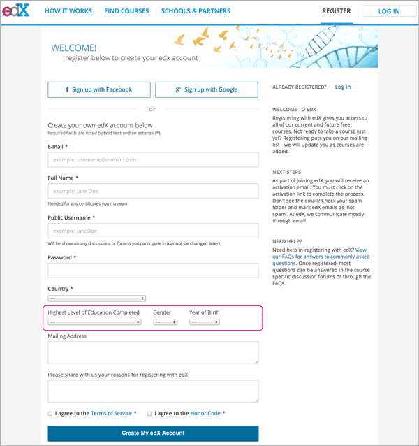
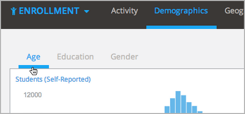

.. _Enrollment_Demographics:

#############################
Enrollment Demographics
#############################

Who is taking my course? Demographic data about your enrolled students helps
quantify characteristics of the people who are taking your course.

EdX Insights delivers demographic data for three population characteristics:
age, educational background, and gender. When students register an edX or edX
Edge user account, they can provide this information about themselves.

       Highest Level of Education Completed, Gender, and Year of Birth circled.

Responses to these questions are optional. Students cannot change the values
that they provide.

.. note:: EdX Insights does not use the values that students select from the 
 **Country** list to determine student location. See :ref:`Location
 Computations`.

In edX Insights, after you select **Enrollment** and then **Demographics**, you
can choose **Age**, **Education**, or **Gender** to access a chart, metrics,
and reports to view or download.

The following chapters provide information about the demographic data that edX
Insights presents.

* :ref:`Demographics_Age`
* :ref:`Demographics_Education`
* :ref:`Demographics_Gender`

To review detailed data about individual enrolled students, you can download
student profile information from the Instructor Dashboard. For more
information, see `Student Data`_ in *Building & Running an edX Course*.

.. _Student Data: http://edx.readthedocs.org/projects/edx-partner-course-staff/en/latest/running_course/course_student.html
