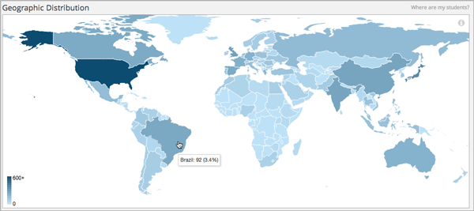

.. _Enrollment_Geography:

####################
Enrollment Geography
####################

Where are my learners from? Enrollment geography data helps you understand the
global reach of your course.

.. contents::
   :local:
   :depth: 2

Enrollment geography data is updated every day. Changes in the locations
for enrolled learners through the end of the previous day (23:59 UTC) are
included.

*************************************
Gaining Insight into Learner Location
*************************************

EdX Insights delivers data about learner location in a map, a set of metrics,
and a report that you can view or download. Descriptions follow; for detailed
information about the computations, see :ref:`Reference`.

===========================
Geographic Distribution Map
===========================

The map uses a color scale to indicate the percentage of current course
enrollment represented by learners from each country or region. The darker the
shade, the higher the enrollment percentage. You can view the current enrollment
count for each country or region by moving your mouse over the map.

In this example, the country or region with the highest number of enrolled
learners is the United States. The cursor is pointing to Brazil, and a tooltip
shows the number and percentage of learners enrolled in the course from that
country or region.

     learners.
 :width: 600

=============================================
Total Countries or Regions Represented Metric
=============================================

This metric reports the number of countries or regions  in which one or more
learners are located.

==============================================
Top Country or Region by Enrollment Percentage
==============================================

This statistic reports the country or region with the highest percentage of learners.

=================================================
Second Country or Region by Enrollment Percentage
=================================================

This statistic reports the country or region with the second highest percentage of
learners.

================================================
Third Country or Region by Enrollment Percentage
================================================

This statistic reports the country or region with the third highest percentage of
learners.

===========================
Geographic Breakdown Report
===========================

.. the downloadable report will have country/total/percentage

The columns in this report show each **Country or Region** and its
**Percentage** and **Current Enrollment**. Learners whose location cannot be
determined are reported in the "Unknown" category.

To download the Enrollment Over Time report in a comma-separated value file,
click **Download CSV**. The CSV file contains the following columns:

* count
* country.alpha2 (the two-character ISO 3166 country code)
* country.alpha3 (the three-character ISO 3166 country code)
* country.name
* course_id
* created (the date and time of the computation)
* date

.. note:: The CSV file is UTF-8 encoded, but not all spreadsheet applications
 interpret and render UTF-8 encoded characters correctly. For example, a French
 country name that includes accented characters displays differently in
 Microsoft Excel for Mac than in OpenOffice Calc. If you notice characters that
 do not display as expected, try a spreadsheet application such as LibreOffice,
 OpenOffice Calc, or Apache OpenOffice to open the CSV file.

See the :ref:`Reference` for a detailed description of how location values are
determined.

.. info on why you might want to download, what to do with csv after

*********************************************************
Analytics in Action: Interpreting Geographic Distribution
*********************************************************

============================
Teaching with a Global Reach
============================

To make their courses more welcoming to a geographically and culturally diverse
learner body, team members have changed their courses in a variety of ways.

* A team in the United States realized that they had almost as many learners
  from India enrolled as from their own country or region. To provide the same
  experience to learners participating across a time difference of more than
  nine hours, the team adjusted their schedules so that discussion moderation
  coverage covered more hours in each day.

* After he identified the top few countries or regions where learners in his
  course were located, one professor made a quick change to some of the homework
  problems. Instead of using first names that are only common among American and
  European learners in the problem text and examples, he sprinkled in names that
  would be familiar to learners in India, Colombia, and China.

  The same professor also checked the scheduled due dates for his course
  assignments, and found that it made sense to change a due date that fell on
  a major festival day in India.

.. * Another team provided a Hindi translation of their course introduction.

=====================================================
Investing Based on Demonstrated Need, Not Predictions
=====================================================

Delivering content, especially videos, to learners in every country or region in
the world means meeting differing technological requirements. Instead of working
to make every video available to a global audience before the course started,
one team took more of a wait-and-see approach. In the months leading up to the
course start date, the team tracked the number of learners who, based on
location, could only access videos if they were hosted on a third-party site.
The team was able to use the actual number and percentage of learners from the
affected country or region in their justification of the increased costs of
creating the alternate video delivery channel.

===================
Fostering Community
===================

When learners enroll in a course and click through from the edX dashboard, they
see the course **Home** page first. One professor welcomed learners into the
course community by including enrollment data from previous iterations of his
course. By showcasing the size and geographic reach of the course in this way,
the professor used the "wow" factor of his MOOC to capture interest and
escalate enthusiasm.
