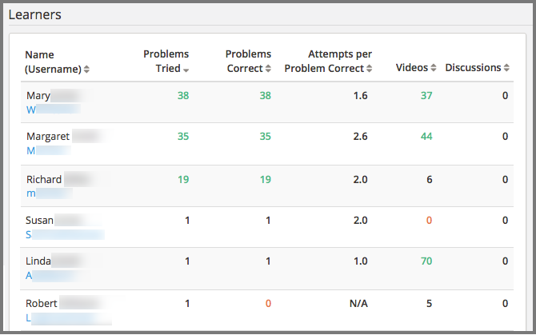
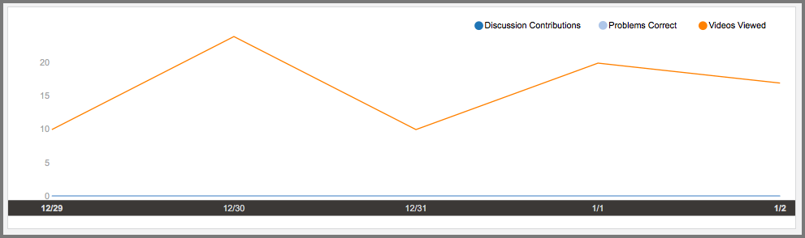
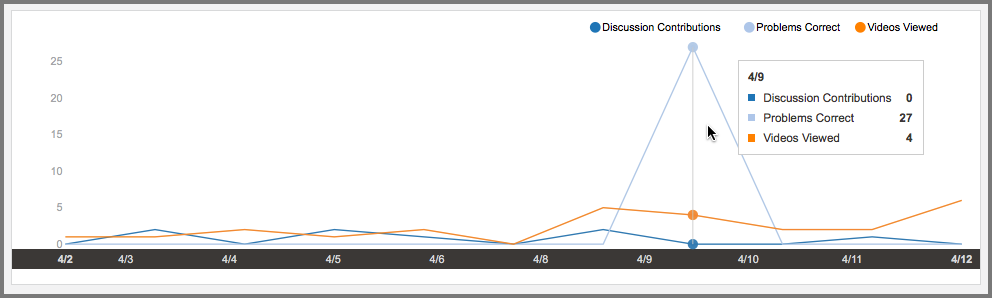
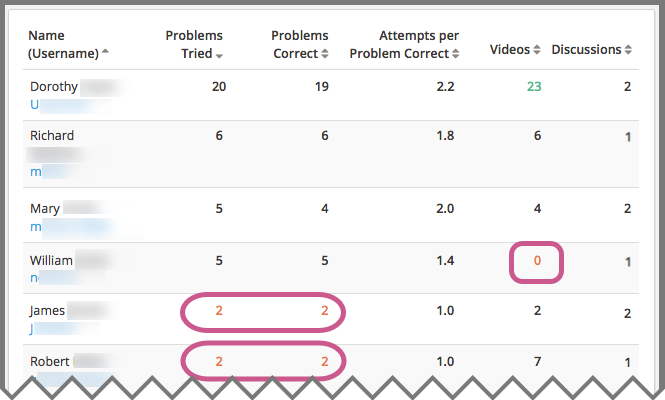

.. _Learner Activity:

################
Learner Activity
################

Which learners, specifically, are engaging with my course? Who is struggling,
and who is doing well? Investigating and comparing the activities of individual
learners helps you focus on those who are most likely to benefit from
additional attention.

.. contents::
   :local:
   :depth: 2

Learner data is updated every day to include activity through the end of the
previous day (23:59 UTC).

**************************************************
Gaining Insight into Individual Learner Activities
**************************************************

Insights delivers data about the activities of individual learners in a
report and in charts of activity over time. Descriptions of the report and
charts follow; for detailed information about the computations, see
:ref:`Learner Computations`.

=========================================
Learner Roster and Key Activity Report
=========================================

Insights delivers data about the engagement of individual learners by
providing counts for the following key activities.

* Problems Tried
* Problems Correct
* Attempts per Problem Correct
* Videos played
* Discussion contributions added

The report includes one row for every learner who ever enrolled in the
course. The reported metrics represent each learner's activity in the course
during the last seven days, through end of day (UTC) yesterday.

Reviewing the Report
********************

To review the learner roster and key activity report, select **Learners**
at the top of any Insights page. By default, the report shows data for all
learners.

To find data that is of interest to you, the report includes the
following options.

* Sort by username or by an activity metric, in ascending or descending order.

* Search for a learner by name or username.

* Filter the report to include only learners who have completed one or more of
  the key activities in the last 14 days. (However, note that only metrics for
  the last seven days are reported. As a result, this filter might also help
  you identify learners who have disengaged during the past week.)

* Select an enrollment track to report only learners who are enrolled in that
  track.

* Select one cohort (in a course that includes learner cohorts).

To help you compare an individual learner's level of engagement to that of the
class as a whole, the numbers on the report include these color and font cues.

* Red, underlined: The learner's activity is in the 15th percentile or below.
  These values can indicate learners who might be falling behind or struggling.

* Green, bold: The learner's activity is in the 85th percentile or above.
  These values can indicate learners who might be doing particularly well.

* Black: All other values.

An example roster follows. In this example, the report is sorted in descending
order by number of problems tried.

  different percentiles.

.. Downloading the Report section when added

========================
Learner Activity Chart
========================

To review the learner activity chart, you select the learner's username in the
learner roster and key activity report.

The learner activity chart is a timeline that shows when a selected learner was
active in the course. The markers on this chart represent the number of times
the learner interacted with the course each day. The graph plots the following
types of activity.

* Discussion Contributions
* Problems Correct
* Videos Viewed

The chart shows when a learner was active in the course, beginning with the
first day that one of these activities took place, and ending with the last day
that one these activities took place. Unlike the roster, this timeline is not
limited to activity in the last seven days.

Examples of learner activity charts follow. The first example shows the
activity chart for a learner who often plays 10 or more course videos per
day. However, the learner is not answering any problems correctly, and has not
yet contributed to the discussions.

     correct activity, but ongoing video activity.

This learner might be getting exactly what they want out of the course, the
opportunity to learn from the videos. However, to get a more complete
understanding of this learner's experience, you could go back to the learner
roster and key activity report to see if this learner is attempting to answer
problems, but not managing to answer any correctly.

The next example shows the activity chart for a learner who occasionally
watches videos, and who has not yet contributed to the discussions. However,
there were only two days on which this learner answered any problems correctly.
The tooltip shows the counts for each type of activity on one of those days.

     and just two days with problems correct activity.

Knowing the context of how your course is set up, this pattern might indicate
that the learner completed the first homework assignment in your self-paced
course and then, after some weeks off, completed the second homework
assignment. Or, it might indicate that the learner started your
instructor-paced course on schedule, but is now rushing to complete the
remaining graded assignments before the end of the course.

Sending Email Messages to Learners
***********************************

To make taking action to help a struggling learner, reengage an inactive
learner, or recognize the achievement of a successful learner easier, the
learner activity chart includes the learner's email address. You can select the
email address to send a message directly to that learner.

Before you use Insights to send email messages to learners, note that this
feature is different from the bulk email feature that is available on the
instructor dashboard of an edx.org course.

* Selecting a learner email address in Insights opens the default email client
  of the computer that you are currently using. As a result, if you use your
  personal computer to access Insights, your personal email address might be
  the default for sending the message. Be sure to use only your official
  institution email address when you communicate with learners by email.

* Insights does not log when messages are sent, or record the email address of
  the sender or the recipient.

When you use Insights, be sure to follow your organization's guidelines for
communicating with learners.

=========================
Activity Over Time Report
=========================

A report of specific course activities that the learner completed each day is
available for review. Columns show the counts of **Discussion Contributions**,
**Problems Correct**, and **Videos Viewed**.

See the :ref:`Reference` section for a detailed description of each value.

**************************************************************
Analytics in Action: Interpreting Individual Activity Patterns
**************************************************************

A review of how many times each of the learners in your course completed key
activities, and when, can help you identify learners who are most likely to
need some form of intervention.

====================================
Identifying Learners Who Are At Risk
====================================

To identify learners who are falling behind, and who might be at risk of
failing, course teams can use the identifiers for activity in the 15th
percentile and below on the learner roster and key activity report. For
example, a course team member can sort the report using any of the metrics, and
then scan the report to locate any learners with a value that is underlined and
in red. In the example that follows, reported values in the 15th percentile and
below are circled.

     any videos at all, and another learner with two problems correct who has
     13.5 attempts per problem correct.

When you review the report, your knowledge of the context can help you decide
whether, and how, to intervene. Some possible scenarios follow.

* The course is a small private online course and it began three days ago. The
  report shows that many learners are engaging with the course, though some
  more than others. You decide to send an email message to all enrolled
  learners at the end of the first week to congratulate them on their efforts
  so far, and to point out that they can track their own achievements on the
  **Progress** page.

* The course is an on campus course, and the third week just started. You use
  the report to identify the learners who are not on pace to complete the
  course successfully, but who might be able to catch up. You make sure that
  all of your teaching assistants know how to use the report to identify such
  learners in their sections.

You can use the learner activity report throughout the course run to guide your
decisions about when, and how, to contact learners who are struggling.

==============================
Promoting Learner Interaction
==============================

A course has several small cohorts with a teaching assistant (TA) assigned to
each one. The members of these cohorts are expected to contribute to the
discussions at least once a week throughout the course run. In turn, the TAs
are responsible for making sure that any questions that cohort members post in
the course discussions get prompt and thorough answers.

The learner roster and key activity report can make monitoring discussion
activity easier for these TAs. The cohort filter and column sorting features
can help them identify the cohort members who are contributing to the
discussions. They can also search by username to find the activity reported for
individual cohort members. The learner activity charts can show, at a glance,
whether discussion activity is a regular part of a learner's weekly involvement
in the course, or if it takes place more sporadically.

==================================
Identifying Questionable Activity
==================================

Certain activity patterns can alert you to behavior that might be either
exemplary or counterproductive. You can use learner data to identify unusual
combinations of activity and decide whether to investigate further. Examples
follow.

* A learner has a high problems correct total, and a very low ratio of attempts
  per problem correct: a top performer. When you look at that learner's
  activity chart, however, you see that all of the problems were answered
  correctly on the very first day the course opened. Did this learner enroll in
  the audit track for a previous course run, and is now taking the course for a
  second time in the verified track? Or, could this learner have violated the
  `honor code`_?

* A learner is in the 85th percentile (or above) for discussion contributions:
  a highly engaged community member. However, the same learner has zero
  problems attempted and zero videos played, so the discussions are the only
  type of key course activity in which the learner engages. Is this learner
  answering questions thoughtfully and with accurate information?

.. _honor code: https://www.edx.org/edx-terms-service#honorcode
