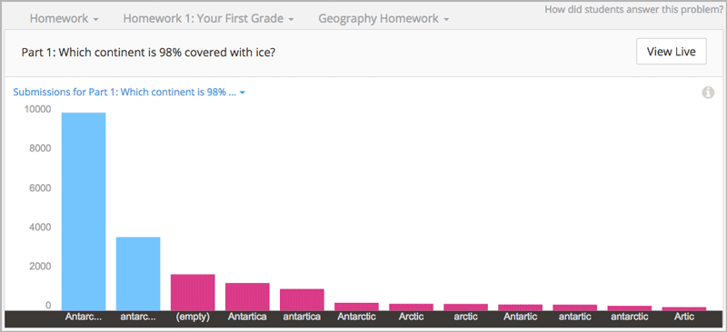
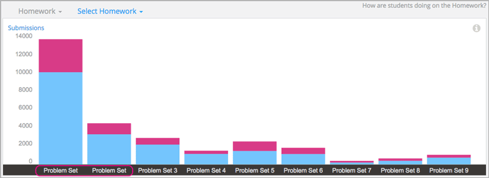
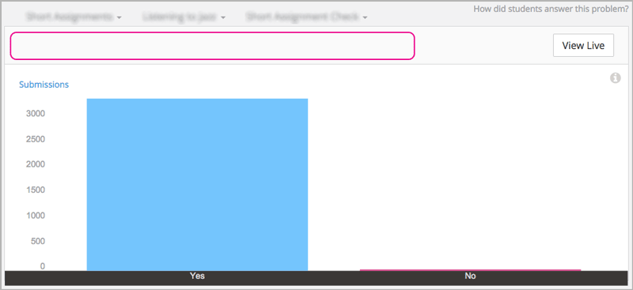
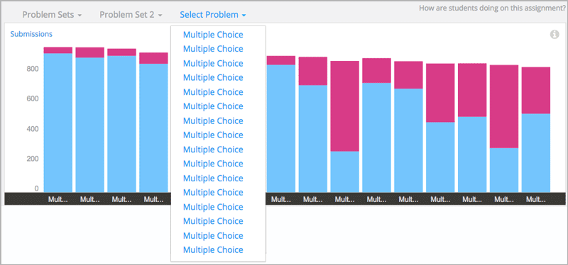
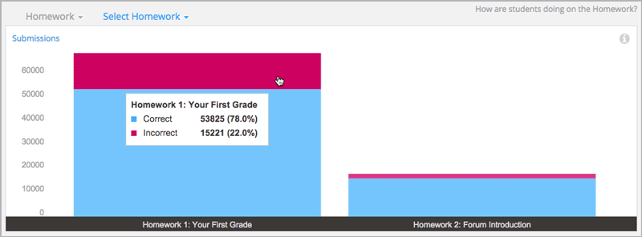
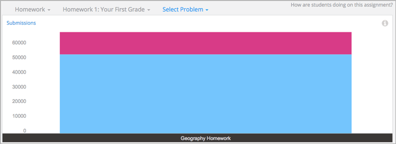
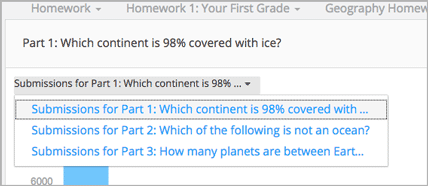
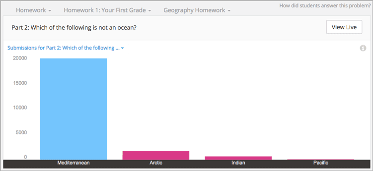
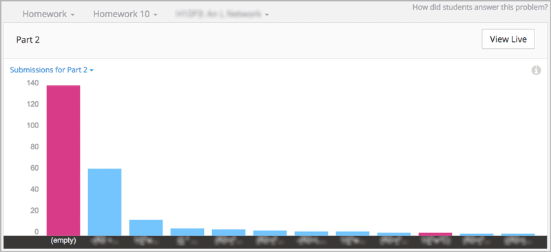

.. _Performance_Graded:

#############################
Graded Content Submissions
#############################

How are students answering questions? In edX Insights, graded content
submissions show you the responses that students submit for graded problems
and help you evaluate what they find difficult. To illustrate, this chapter
presents the Analytics in Action section first.

After the Analytics in Action examples, this chapter describes how you
:ref:`select an assignment type, assignment, and problem<Selecting the
Assignment Type, Assignment, and Problem>` and then :ref:`review student
answers<Review Answers to Graded Problems>`. 

*******************************************************
Analytics in Action: Interpreting Graded Submissions
*******************************************************

A review of the distribution of student answer submissions for a graded
problem can lead to discoveries about your students and about your course.

* You can assess how difficult the problem is for students to answer correctly. 

* You can detect common mistakes.

* You can understand student misconceptions.

* You can find errors in problem components.

In addition, you can use the aggregate data in the graphs of your assignment
types and assignments to identify where students are submitting more incorrect
answers.

===============================================
Researching Unexpected Difficulties
===============================================

For problem types that provide both the question and a set of possible answers
(checkboxes, dropdown, and multiple choice), submission data helps you assess
how difficult it is for students to identify and submit the correct answer.
With the submissions chart, you can visually contrast the number of students
who select incorrect answers with the number who answer correctly.

If the proportion of students who answer the problem incorrectly surprises
you, research can reveal a variety of causes. Your investigation might begin
with some of these questions.

* Is the text of the question and of its possible answers clear? Has it been
  translated accurately?

* Does the course outline include relevant course content before the problem,
  or after it?

* Are all of the course prerequisites presented to potential students?

* Does the problem rely on student access to a video or textbook? Are there
  transcripts for the videos, and can the textbook files be read by a screen
  reader?

* Are students relying on conventional wisdom to answer the question instead
  of newly acquired knowledge?

The results of your investigation can guide changes to future course runs.

=================================
Investigating Similar Responses
=================================

For open-ended problem types that provide only the question (numerical, text,
and math expression input), submission data can help you identify similar
responses. In the Submission Counts report you have access to every answer
submitted by a student. The chart, however, presents only the 12 most
frequently submitted responses. Your initial investigation into how students
answer a question can begin with this set.

For example, the edX Demo course includes a text input problem that has a
correct answer of "Antarctica". The problem is set up to recognize other
variations in capitalization for this English spelling as correct.

     submissions have different colors.

.. edX/DemoX.1/2014/performance/graded_content/assignments/i4x%3A//edX/DemoX.1/sequential/9c1aacbb2795470e8473b059b59c3344/problems/i4x%3A//edX/DemoX.1/problem/466f474fa4d045a8b7bde1b911e095ca/parts/i4x-edX-DemoX_1-problem-466f474fa4d045a8b7bde1b911e095ca_2_1/answer_distribution/

When you review the submissions chart for the problem, you see that the two
most frequently submitted answers are both marked correct: Antarctica and
antarctica. You also note that several misspelled variations, including
"Antarctic" and "Antartica", are marked incorrect.

A review of the Submissions Count report reveals several more variations,
including "antartika", "Antartide", and "el continente Antártico". You realize
that these answers also indicate the continent of Antarctica, but in languages
other than English. Seeing answers such as these in the report might reassure
you that more students understand the question and the relevant course
material than is indicated by the correct answer count. You might then decide
to reconfigure the problem so that correct answers in other languages also
evaluate as correct. Alternatively, you might decide to revise the question to
specify that answers be given in English only.

=====================================================
Reviewing Answers to Test and Complete Course Setup
=====================================================

Before the release date of each section, you encourage your beta testers to
answer every question and to submit both correct and incorrect answers.
You then use edX Insights to review the answers that your testers submit for
each problem. You verify that each problem is set up as you intend, and
correct any oversights before students can encounter them.

In this way, you can use edX Insights to validate the grading configuration,
and to proofread the display names, accessible labels, and text that you have
provided for the graded assignment types, assignments, problems, questions,
and answers.

For example, the first time you use edX Insights to look at student
performance, you choose the "Homework" assignment type. In the chart of the
homework assignments, you see the nine assignments that you expect. However,
you notice that for your first two homework assignments, you forgot to include
the distinguishing number after the name "Problem Set".

.. MITx/6.832x/3T2014/performance/graded_content/Homework/

In another example, you use edX Insights to check the answers that your beta
testers submitted for one of the questions in a quiz. You notice that the chart
for this question does not have a title. For this problem component, you
neglected to identify the question with an accessible label.

.. UTAustinX/UT.8.02x/1T2015/performance/graded_content/assignments/i4x%3A//UTAustinX/UT.8.02x/sequential/d8dd4296856a4745b1afd7d7c4aef7f6/problems/i4x%3A//UTAustinX/UT.8.02x/problem/802cd3308245482b870ca7f36a3cd282/parts/i4x-UTAustinX-UT_8_02x-problem-802cd3308245482b870ca7f36a3cd282_2_1/answer_distribution/

You can select **View Live** to see what the problem looks like in the LMS,
and from there select **View Unit in Studio** to add the accessible label to
the problem.

In this last example, when you see the chart for an assignment you realize
that you did not change the default display name, "Multiple Choice", for any
of the problems that it includes.

.. MITx/9.01x/3T2014/performance/graded_content/assignments/i4x%3A//MITx/9.01x/sequential/19aa8209e5474d52aab965f0f1649270/

Because students see problem display names in the LMS, you might decide to go
back to Studio and provide identifying display names for the problems before
you publish the subsection.

.. _Selecting the Assignment Type, Assignment, and Problem:

*******************************************************
Selecting the Assignment Type, Assignment, and Problem
*******************************************************

To access data about the answers that students submit for a graded problem
component, you make these selections.

Step 1: Select a graded course assignment type.

Step 2: Select an assignment. 

Step 3: Select a problem.

EdX Insights provides aggregated data for each selection that you make. 

==================================
Step 1: Select an Assignment Type
==================================

After you select **Performance** and **Graded Content**, edX Insights displays
the assignment types that make up the grading configuration of the course. You
use the drop-down **Select Assignment Type** menu or click an item in the
grading configuration to select the assignment type to investigate.

.. image:: ../images/assignment_type.png
 :alt: Single bar showing the percentage that each assignment type contributes
     to the grade.

.. edX/DemoX.1/2014/performance/graded_content/

For information about defining course assignment types, see `Establishing a
Grading Policy`_.

==============================
Step 2: Select an Assignment 
==============================

After you select one of the course assignment types, edX Insights displays a
stacked bar chart that summarizes student performance on each assignment of
that type. 

     percentage of correct and incorrect submissions.

.. edX/DemoX.1/2014/performance/graded_content/Homework/

The Assignment Submissions report on this page provides the number of
problems in each assignment and the aggregate number of correct and incorrect
submissions received for each one.

For information about identifying the graded subsections in a course, see `Set
the Assignment Type and Due Date for a Subsection`_.

You use the drop-down **Select {Assignment Type}** menu or click a bar in the
chart to select the assignment you want to examine further.

=========================
Step 3: Select a Problem
=========================

After you select an assignment, edX Insights displays a stacked bar chart that
summarizes student performance on each problem in that assignment. In this
example from the edX Demo course, the selected homework assignment includes
just one problem.

.. edX/DemoX.1/2014/performance/graded_content/assignments/i4x%3A//edX/DemoX.1/sequential/9c1aacbb2795470e8473b059b59c3344/

The Problem Submissions report on this page provides the number of questions
in each problem and the aggregate number of correct and incorrect submissions
received for each one.

For information about adding a unit to a subsection, see `Create a Unit`_.

You use the drop-down **Select Problem** menu or click a bar in the chart to
select the problem that you want to examine further.

If the problem that you select includes more than one part (or question), the
first part appears. To select a different part, you use the drop-down
**Submissions for Part {number}** menu. In the Demo course example, the
selected homework problem has three parts.

     parts.

.. edX/DemoX.1/2014/performance/graded_content/assignments/i4x%3A//edX/DemoX.1/sequential/9c1aacbb2795470e8473b059b59c3344/problems/i4x%3A//edX/DemoX.1/problem/466f474fa4d045a8b7bde1b911e095ca/parts/i4x-edX-DemoX_1-problem-466f474fa4d045a8b7bde1b911e095ca_2_1/answer_distribution/

.. _Review Answers to Graded Problems:

*************************************
Review Answers to Graded Problems
*************************************

After you select a problem or problem part, edX Insights displays submission
data in a bar chart and a report that you can view or download. Descriptions
of the chart and report follow. For detailed information about the
computations, see :ref:`Reference`.

.. note:: Problems that use the **Randomization** setting in Studio result in
 many possible submission variants, both correct and incorrect. As a result,
 edX Insights does not attempt to present a chart of the responses submitted
 for these problems. You can download the Submissions Counts report to
 analyze the answers that are of interest.

==================
Submissions Chart
==================

The bars on this chart represent the number of enrolled students who submitted
a particular answer to a question in a problem component. The x-axis includes
the most frequently submitted answers, up to a maximum of 12. Due to space
limitations, the answer text that is used to label the x-axis might be
truncated. Moving your cursor over each bar shows a longer version of the
answer.

To review the problem component in the LMS as a student sees it, select **View
Live** and then at the top of the page use the **View this course as** option
to select Student. The LMS displays the page that contains this problem in
Student View. For more information, see `View Your Live Course`_.

All submitted answers, and complete answer values, are available for review in
tabular format at the bottom of the page and can also be downloaded.

Examples of the graded content submissions chart follow. In the first example,
most students selected the correct answer for a multiple choice problem.

       out of four choices.

.. edX/DemoX.1/2014/performance/graded_content/assignments/i4x%3A//edX/DemoX.1/sequential/9c1aacbb2795470e8473b059b59c3344/problems/i4x%3A//edX/DemoX.1/problem/466f474fa4d045a8b7bde1b911e095ca/parts/i4x-edX-DemoX_1-problem-466f474fa4d045a8b7bde1b911e095ca_3_1/answer_distribution/

The second example shows the graph of the top 12 answers submitted for a
numerical input problem. Most students left the answer for this question
blank, or "(empty)", which was marked incorrect. Other answers that students
submitted, both correct and incorrect, are also graphed. The
Submission Counts report includes a row for every submitted answer.

       with bars for the 12 most frequent answers.

.. MITx/EECS.6.002x/3T2013/performance/graded_content/assignments/i4x%3A//MITx/EECS.6.002x/sequential/Homework_10/problems/i4x%3A//MITx/EECS.6.002x/problem/H10P3_An_L_Network/parts/i4x-MITx-EECS_6_002x-problem-H10P3_An_L_Network_3_1/answer_distribution/

For more information, see the :ref:`Reference`.

=========================
Submission Counts Report
=========================

A report with a row for each problem-answer combination submitted by your
students is available for review or download. The report columns show each
submitted answer, identify the correct answer or answers, and provide the
number of students who submitted that answer.

To download the Submission Counts report in a comma-separated value
file, select **Download CSV**.

The report includes one row for each problem-answer combination submitted by a
student. For example, consider a dropdown problem that has five possible
answers. The report or file contains up to five rows, one for each answer
submitted by at least one student.

For problems that use the **Randomization** feature in Studio, the report has
one row for each problem-variant-answer combination selected by at least one
student. For more information about this randomization option, see
`Randomization`_.

See the :ref:`Reference` for a detailed description of each column.

.. _Randomization: http://edx.readthedocs.org/projects/edx-partner-course-staff/en/latest/creating_content/create_problem.html#randomization

.. _View Your Live Course: http://edx.readthedocs.org/projects/edx-partner-course-staff/en/latest/developing_course/testing_courseware.html?highlight=view%20live#view-your-live-course

.. _Establishing a Grading Policy: http://edx.readthedocs.org/projects/edx-partner-course-staff/en/latest/building_course/establish_grading_policy.html

.. _Set the Assignment Type and Due Date for a Subsection: http://edx.readthedocs.org/projects/edx-partner-course-staff/en/latest/developing_course/course_subsections.html#set-the-assignment-type-and-due-date-for-a-subsection

.. _Create a Unit: http://edx.readthedocs.org/projects/edx-partner-course-staff/en/latest/developing_course/course_units.html#create-a-unit