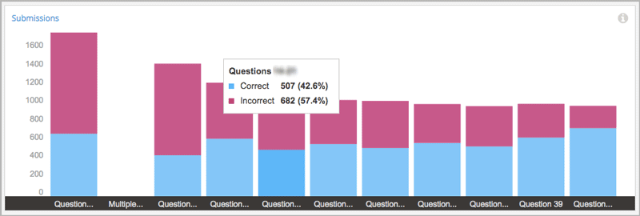
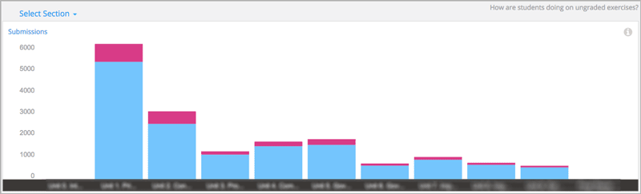
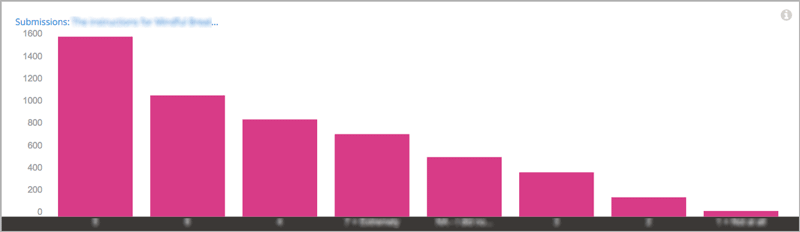
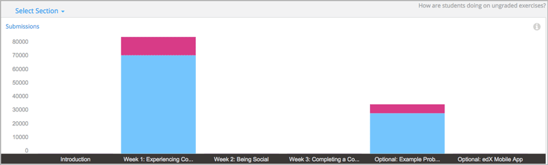
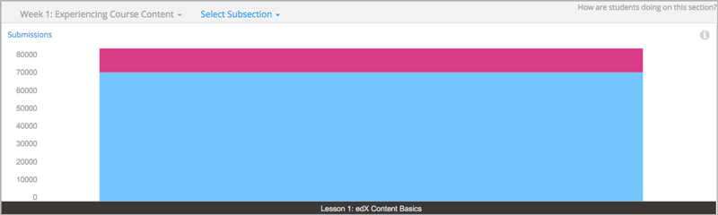
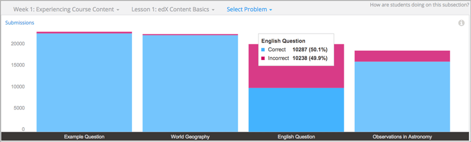
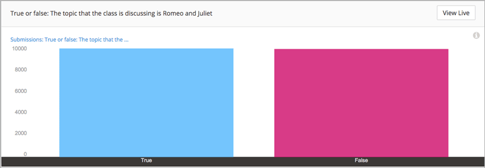

.. _Performance_Ungraded:

#############################
Ungraded Problem Submissions
#############################

How do learners answer problems that do not count toward their course grades?
Do they answer these questions at all? Using edX Insights, you can review data
for the ungraded problems in a course and its sections. This data shows you how
many learners are submitting answers, and the average number of answers that
are correct.

Then, you can review the actual responses learners make to
questions that are not part of the grading configuration for your course. You
can also compare data about ungraded and graded course content. Information
about learner performance on ungraded problems can help you understand where
learners are making errors, and also find ways to improve the problems.

.. contents::
   :local:
   :depth: 2

*******************************************************
Analytics in Action: Interpreting Ungraded Submissions
*******************************************************

A review of the distribution of answer submissions for an ungraded problem can
lead to discoveries about your learners and about your course.

============================
Initial Assessments
============================

Ungraded problems that are included early in the courseware can provide
valuable information about how well prepared enrolled learners are to complete
your course successfully. You can use edX Insights to answer questions like
these.

* What percentage of enrolled learners completed the initial set of exercises?

* Do the submissions demonstrate the core competencies that you expect?

* Do the submissions reflect common misconceptions?

.. Victor, more or better questions?

The illustration that follows is for a course that includes a preliminary
assessment during "Week 0". The chart includes one bar for each of the problems
in the subsection that contains the assessment. The average number of incorrect
answers, in pink, is stacked on top of the average number of correct answers,
in blue, in each bar. The chart indicates that for most of the questions in the
preliminary assessment, a significant percentage of learners submitted an
incorrect answer.

     incorrect answer for most of the questions.

.. BUx/PY1x/1T2015/performance/ungraded_content/sections/i4x%3A//BUx/PY1x/chapter/1e2e85d75de44431a83f698c1aed99b6/subsections/i4x%3A//BUx/PY1x/sequential/1dbce9aea0fb4df1b22521cb02fd1c17/

Reviewing this information early in the course run can help you decide whether
to take any action, and what that action might be. For example, if relatively
few of the enrolled learners are answering the question, you might decide to
add a link to the edX DemoX course on your **Course Info** page. To help
learners understand course prerequisites better, you could upload references
to additional preparatory material. Or, you could decide to post more
frequently, and with more detail, in the content-specific course discussions.

============================
Practice Problems
============================

To give learners opportunities to practice, gain confidence, and learn from
their mistakes, many courses include ungraded problems throughout. The data
available for practice problems in edX Insights can help you answer questions
like these.

* What percentage of learners submit answers to the practice problems? Does
  that percentage change over time?

* Do more learners answer the practice problems or the graded problems?

* Do more learners answer the practice problems correctly, or the graded
  problems?

The illustration that follows is for a course that includes ungraded practice
problems in most sections. The chart includes one bar for each section in the
course. Each bar shows the average number of incorrect answers for the entire
section, in pink, stacked on top of the average number of correct answers, in
blue. These values are averaged by the number of problems in each section.

In this course, the number of learners submitting answers in each section went
down over time. However, the number of learners who submitted the correct
answer went up.

  lower percentages of incorrect answers.

.. CaltechX/Ec1011x/1T2014/performance/ungraded_content/

You can use this data for course sections and subsections to track changes in
how many learners are working through the practice problems. You can also
compare the answers submitted for similar ungraded and graded problems.
Depending on what you find, you might consider changes to future versions of
the course. For example, you might add or revise the explanations for the
practice problems, add hints or feedback, or increase the number of attempts
that learners have to submit the correct answer. You might also be able to find
and address differences in problem difficulty.

===============================================
Surveys
===============================================

.. The semi-critical "show_correctness" attribute that one sets in Studio is not currently documented...

If you use problem components to survey your learners, you can use edX
Insights to review their responses. The data available for survey-type
problems in edX Insights can help you answer questions like these.

* How many learners responded?

* For questions with a limited number of possible answers, such as multiple
  choice, what percentage of learners selected each answer?

* For open-ended questions, such as text input, what did learners submit?

The illustration that follows shows the number of learners who selected each
of the choices offered for a multiple choice question. The chart includes one
bar for each answer.

.. note:: If you do not explicitly identify a correct answer for a
 question in Studio, all submitted answers are marked as incorrect. As a
 result, the bar charts for these questions appear in a single color.

     incorrect.

.. BerkeleyX/GG101x/1T2014/performance/ungraded_content/sections/i4x%3A//BerkeleyX/GG101x/chapter/d13fe70f7ca44a8f85f2d38efdc8d86c/subsections/i4x%3A//BerkeleyX/GG101x/sequential/0c8e4c5cdb3a4329a9a12f2e33c1fd76/problems/i4x%3A//BerkeleyX/GG101x/problem/89d1916b958341129ad23fd75a09df48/parts/i4x-BerkeleyX-GG101x-problem-89d1916b958341129ad23fd75a09df48_2_1/answer_distribution/

The downloadable reports of answer data that are available from Insights can
aid further analysis of survey answers.

.. _Selecting the Section, Subsection, and Problem:

*******************************************************
Selecting the Section, Subsection, and Problem
*******************************************************

To access data about the answers that learners submit for an ungraded problem
component, you make these selections.

Step 1: Select a section in the course.

Step 2: Select a subsection.

Step 3: Select a problem.

EdX Insights provides data for each selection that you make.

==================================
Step 1: Select a Section
==================================

After you select **Performance** and **Ungraded Problems**, edX Insights
displays a stacked bar chart that summarizes learner performance on ungraded
problems in every section in the course.

  ungraded content.

.. edX/DemoX.1/2014/performance/ungraded_content/

The graph includes a bar for a section only if that section both contains an
ungraded problem and at least one learner has submitted an answer. You use the
drop-down **Select Section** menu, or click a bar in the chart, to select a
section to investigate.

The Section Submissions report on this page provides the number of ungraded
problems in each course section, and the average number of correct and
incorrect submissions received based on the number of problems in each section.

==============================
Step 2: Select a Subsection
==============================

After you select the course section, edX Insights displays a stacked bar chart
that summarizes learner performance on the ungraded problems in each
subsection. In this example from the edX DemoX course, there is only one
subsection in the selected section.

The Subsection Submissions report on this page provides the number of ungraded
problems in each subsection and the number of correct and incorrect submissions
received, averaged by the number of problems in each section.

You use the drop-down **Select Subsection** menu or click a bar in the
chart to select the subsection you want to examine further.

=========================
Step 3: Select a Problem
=========================

After you select a subsection, edX Insights displays a stacked bar chart that
summarizes learner performance on each problem in that assignment. In this
example from the edX Demo course, the selected subsection includes
four problems.

     subsection.

.. edX/DemoX.1/2014/performance/ungraded_content/sections/i4x%3A//edX/DemoX.1/chapter/0af8db2309474971bfa70cda98668a30/subsections/i4x%3A//edX/DemoX.1/sequential/ec3364075f2845baa625bfecd5970410/

The Problem Submissions report on this page includes a line for each of the
problems in the selected subsection, and the number of correct and incorrect
submissions received for each one.

You use the drop-down **Select Problem** menu, or click a bar in the chart, to
select the problem that you want to examine further. If the problem that you
select includes more than one part (or question), the first part appears. To
select a different part, you use the drop-down **Submissions for Part
{number}** menu.

.. _Review Answers to Ungraded Problems:

*************************************
Review Answers to Ungraded Problems
*************************************

After you select a problem or problem part, edX Insights displays submission
data in a bar chart and a report that you can view or download. Descriptions
of the chart and report follow. For detailed information about the
computations, see :ref:`Reference`.

.. note:: Problems that use the **Randomization** setting in Studio result in
 many possible submission variants, both correct and incorrect. As a result,
 edX Insights does not attempt to present a chart of the responses submitted
 for these problems. You can download the Submissions Counts report to
 analyze the answers that are of interest.

==================
Submissions Chart
==================

The bars on this chart represent the number of enrolled learners who submitted
a particular answer to a question in a problem component. The x-axis includes
the most frequently submitted answers, up to a maximum of 12. Due to space
limitations, the answer text that is used to label the x-axis might be
truncated. Moving your cursor over each bar shows a longer version of the
answer.

     a True or False question.

.. edX/DemoX.1/2014/performance/ungraded_content/sections/i4x%3A//edX/DemoX.1/chapter/0af8db2309474971bfa70cda98668a30/subsections/i4x%3A//edX/DemoX.1/sequential/ec3364075f2845baa625bfecd5970410/problems/i4x%3A//edX/DemoX.1/problem/47bf6dbce8374b789e3ebdefd74db332/parts/i4x-edX-DemoX_1-problem-47bf6dbce8374b789e3ebdefd74db332_2_1/answer_distribution/

To review the problem component in the LMS the way a learner sees it, select
**View Live** and then at the top of the page use the **View this course as**
option to select learner. The LMS displays the page that contains this problem
in learner View. For more information, see `View Your Live Course`_.

All submitted answers, and complete answer values, are available for review in
tabular format at the bottom of the page and can also be downloaded.

For more information, see the :ref:`Reference`.

=========================
Submission Counts Report
=========================

A report with a row for each problem-answer combination submitted by your
learners is available for review or download. The report columns show each
submitted answer, identify the correct answer or answers, and provide the
number of learners who submitted that answer.

To download the Submission Counts report in a comma-separated value
file, select **Download CSV**.

The report includes one row for each problem-answer combination submitted by a
learner. Only the most recent attempt submitted by each learner is included in
the count. For example, consider a dropdown problem that has five possible
answers. The report or file contains up to five rows, one for each answer
submitted by at least one learner in their last attempt to answer the problem.

If the problem that you select includes more than one part, the chart and
report for the first part appears. To select a different part, you use the
**Submissions for Part {number}** drop-down.

For problems that use the **Randomization** feature in Studio, the report has
one row for each problem-variant-answer combination selected by at least one
learner. For more information about this randomization option, see
`Randomization`_.

See the :ref:`Reference` for a detailed description of each column.

.. _Randomization: http://edx.readthedocs.org/projects/edx-partner-course-staff/en/latest/creating_content/create_problem.html#randomization

.. _View Your Live Course: http://edx.readthedocs.org/projects/edx-partner-course-staff/en/latest/developing_course/testing_courseware.html?highlight=view%20live#view-your-live-course
